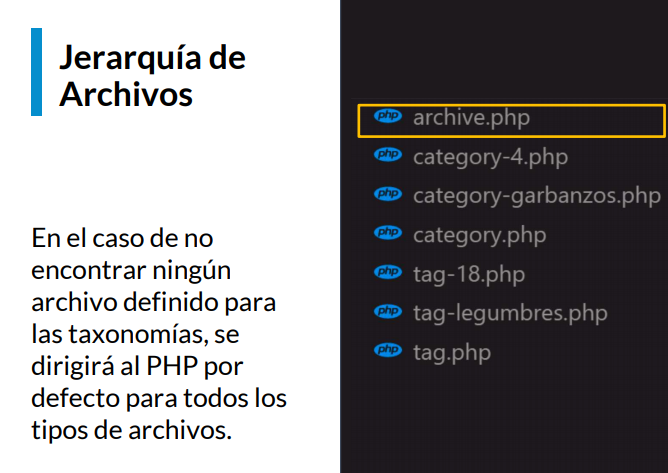

# Curso Práctico de WorPress


## Tabla de contenido

- [Introducción](#introducción)
- [Entorno de desarrollo profesional con Flywheel](#entorno-de-desarrollo-profesional-con-flywheel)
- [Personalizar una Categoría en WordPress](#personalizar-una-Categoría-en-WordPress)
- [Conectar las categorías con archive.php](#conectar-las-categorías-con-archive.php)
- [Importancia de la Navegabilidad](#importancia-de-la-navegabilidad)
- [Qué es un Post Type](#qué-es-un-post-type)
- [Qué es una taxonomía personalizada](#qué-es-una-taxonomía-personalizada)
- [Qué es un Page template](#qué-es-un-page-template)
- [Funcionamiento de los emails en WordPress](#funcionamiento-de-los-emails-en-wordpress)
- [AJAX dentro de WordPress](#ajax-dentro-de-wordpress)
- [Añadir un Filtro dinámico con AJAX](#añadir-un-filtro-dinámico-con-ajax)
- [Utilizar la API de WordPress](#utilizar-la-api-de-wordpress)
- [Los Endpoints en la API de WordPress](#los-endpoints-en-la-api-de-wordpress)
- [Los bloques en Gutenberg en WordPress](#los-bloques-en-gutenberg-en-wordpress)
- [Crear bloques dinámicos en Gutenberg](#crear-bloques-dinámicos-en-gutenberg)
- [Crear bloques con ACF](#crear-bloques-con-acf)
- [Crea un bloque igual a ACF pero de forma nativa](#crea-un-bloque-igual-a-acf-pero-de-forma-nativa)
- [Llevar un sitio a producción](#llevar-un-sitio-a-producción)
- [Optimizar la indexación y el SEO](#optimizar-la-indexación-y-el-seo)
- [Seguridad en WordPress](#seguridad-en-wordpress)


## Introducción

Vamos a aprender como organizar el contenido dentro de WordPress, como diferenciar la interfaz de los distintos tipo de contenido, algunas de las funciones más avanzadas como el uso de emails, AJAX, la integración con su API y la creación de bloques para su nuevo editor.

## Entorno de desarrollo profesional con Flywheel

https://localwp.com/ esta herramienta llamada flywheel que nos provee entornos de desarrollo optimizados para WordPress.

## Personalizar una Categoría en WordPress

Para organizar la información en wordpress la información se representa por:

- **Taxonomies:** Agrupamiento de terminos
- **Terms:** Agrupamiento de contenido o los POST
- **Post**: Es el contenido a mostrar.

Generamos diferentes taxonomías, se las vamos a generar a diferentes tipos de contenido, pero las taxonomías y los contenidos no van a estar relacionados entre si, lo que los van a relacionar son los **términos**. La taxonomía es un agrupamiento de términos y unos términos que son agrupamientos de contenido. Esos términos son los que en realidad van a configurar nuestra estructura del sitio y son las diferentes categorías que vamos a utilizar.

**Wordpress tiene dos taxonomías por defecto**

- **Category**: Se aplica al "Post Type" y permite agrupaciones de forma jerárquica.
- **Tag**: Se aplica al "Post type" y permite agruparlos pero no de forma jerárquica.

**Como se prensenta la información en Wordpress**:

https://www.hostinger.co/tutoriales/jerarquia-de-plantillas-de-wordpress
https://wphierarchy.com/

<div align="center">
  
  <small><p>Ejemplo del funcionamiento de las taxonomías</p></small>
</div>


<div align="center">
  
  <small><p>Jerarquía de las taxonomías-los slugs</p></small>
</div>


<div align="center">
  
  <small><p>Jerarquía de las taxonomías-los IDS</p></small>
</div>


<div align="center">
  
  <small><p>Jerarquía de las taxonomías-archivo genérico</p></small>
</div>

## Conectar las categorías con archive.php


Asignamos una categoría a todas nuestras entradas, por defecto WordPress asigna una categoría `sin Nombre` a todas las entradas(posts). Nos vamos al Admin de WordPress y le asignamos una categoría.

Ahora creamos un `archive.php` para mostrar una taxonomía.

`archive.php`

```php
<? php get_header() ?>
<div class="container my-4">
  <div class="row">
    <div class="col-12 text-center">
      <h1><?php the_archive_title(); ?></h1> // Función para el titulo de nuestro archive.php
    </div>
      <?php if( have_posts()){ // loop básico
        while(have_posts()) {
          the_post();
      ?>
      <div class="col-4 text-center-single-archive">
        <a href="<?php the_permalink(); ?>"> // para ingresar al enlace del post
          <?php the_post_thumbnail('large'); ?> // para la imegen destacada
          <h4><?php the_title();?></h4>
        </a>
      </div>
        <?php } ?>
      <?php } ?>
  </div>
</div>
<? php get_footer() ?>

```

## Importancia de la Navegabilidad


Los tipos de navegación en WordPress son:

- **paginados**: se utilizan en las taxonomías para dividir los resultados en varias páginas
- **Entre entradas**: Permite moverse a la entrada anterior o la siguiente entrada en un orden cronológico.

```php
<? php get_header() ?>
<div class="container my-4">
  <div class="row">
    <div class="col-12 text-center">
      <h1><?php the_archive_title(); ?></h1> // Función para el titulo de nuestro archive.php
    </div>
      <?php if( have_posts()){ // loop básico
        while(have_posts()) {
          the_post();
      ?>
      <div class="col-4 text-center-single-archive">
        <a href="<?php the_permalink(); ?>"> // para ingresar al enlace del post
          <?php the_post_thumbnail('large'); ?> // para la imegen destacada
          <h4><?php the_title();?></h4>
        </a>
      </div>
        /*La función get_template_part() que sirve para llamar fragmentos de código desde distintos
         archivos que tengamos en otras ubicaciones para poder reutilizarlos dentro de diferentes
         archivos.
         Recibe dos parámetros, el primero es la carpeta donde va a estar ubicado nuestro
         fragmento de cógido o nuestro archivo de fragmento de código que queremos traer
         y el segundo parámetro de todos los archivos que comiencen con la palabra post cual es
         el que queremos traer
         */
      <?php get_template_part('template-parts/post', 'navigation') ?>
        <?php } ?> //End while
      <?php } ?> // end if
  </div>
</div>
<? php get_footer() ?>

```


Creamos el archivo `template-parts/post-navigation.php`


`post-navigation.php`

```php
<div class="row my-5">
  <div class="col-6">
    <?php previous_post_link()?> // es una funcioón de wordpress para generar el
    // el enlace al post anterior que estamos leyendo.
  </div>
  <div class="col-6">
    <?php next_post_link()?> // es una funcioón de wordpress para generar el
    // el enlace al post siguiente que estamos leyendo.
  </div>
</div>
```

https://developer.wordpress.org/reference/functions/get_template_part/

https://developer.wordpress.org/reference/functions/previous_post_link/

## Qué es un Post Type


Los post types son diferentes tipos de contenido que nos permiten a nosotros generar distintos tipos de contenido y generar distintos tipo d publicaciones, es un tipo de contenido personalizado que básicamente nos permite es diferenciarlo de todos los demás tipos de contenido en este caso nosotros creamos uno que es el de productos.


<div align="center">
  
  <small><p>Jerarquía de los post types</p></small>
</div>


copiamos el archivo `single.php` por `single-producto.php`


`single-producto.php`


```php
<?php get_header(); ?> // cargamos el header
<main class='container my-3'>
// producto especifico
  <h1><?php the_title();?></h2>
    <?php if(have_posts()){ ?>// Loop básico
            <?php while(have_posts()){ ?>// while para instanciar el contenido de nuestra page
                <?php the_post(); ?>
            <div class="row my-5">
              <div class="col-6 col-12">
                <?php the_post_thumbnail('large'); ?> // le pasamos una imagen en versión large
              </div>
              <div class="col-6 col-12">
                <?php the_content();?> // función para mostrar el contenido
              </div>
            </div>
            // productos relacionados
            <?php $args = array(
              'post-type' => 'producto',
              'post_per_page' => 6,
              'order' => 'ASC',
              'orderby' => 'title'
            );
            $productos = new WP_Query($args); ?> // loop personalizado

            <?php if ($productos->have_posts()); {?>
               <div class="row text-center justify-content-center productos-relacionados">
               <div class="col-12">
                <h3>Productos relacionados</h3>
               </div>
                <?php while (productos-> have_posts());{?>
                  <?php $productos -> the_post(); ?>
                    <div class="col-2 my-3 text-center">
                      <?php the_post_thumbnail('thumbnail');?>
                      <h4>
                        <a href="<?php the_permalink(); ?>"></a>
                        <?php the_title(); ?>
                      </h4>
                    </div>
                <?php}?> // end while loop personalizado
               </div>
            <?php } ?> // end if loop personalizado
         <?php } ?> // end while loop basico
    <?php } ?> // end if loop basico
</main>
```


## Qué es una taxonomía personalizada

WordPress nos provee de las taxonomías para poder ordenar el contendido de nuestro sitio, las taxonomías por defecto son las **categorías** y las **etiquetas**, pero también nos permite registrar taxonomías personalizadas. Esto se hace por medio de la función `register_taxonomy()` No solo permite crearlas si no también asignarlas a diferentes tipos de post. Por otro lado las taxonomías nos permiten desarrollar distintas interfaces. Novedades y producto por ejemplo.

**Jerarquia de las taxonomías**


<div align="center">
  
  <small><p>Jerarquía de las taxonomías</p></small>
</div>


`functions.php`


```php
<?php

function init_template(){
    add_theme_support( 'post-thumbnails');
    add_theme_support( 'title-tag' );

    register_nav_menus(
        array(
          'top_menu' => 'Principal'
        )
    );
}


add_action('after_setup_theme','init_template');

function template_styles(){
    wp_register_style('bootstrap','https://stackpath.bootstrapcdn.com/bootstrap/4.4.1/css/bootstrap.min.css',false,'4.4.1','all');
    wp_register_style('montserrat','https://fonts.googleapis.com/css?family=Montserrat&display=swap',false,'','all');
    wp_enqueue_style('main-style', get_stylesheet_uri(), array('bootstrap','montserrat'),'1.0','all');

    wp_register_script( 'popper', 'https://cdn.jsdelivr.net/npm/popper.js@1.16.0/dist/umd/popper.min.js', false, true );
    wp_enqueue_script( 'bootstrap', 'https://stackpath.bootstrapcdn.com/bootstrap/4.4.1/js/bootstrap.min.js', array('jquery','popper'), true);

    wp_enqueue_script( 'custom', get_template_directory_uri()."/assets/js/custom.js", false,"1.1", true );
}

add_action('wp_enqueue_scripts','template_styles');


function registrar_sidebar(){
    register_sidebar( array(
        'name' => 'Pie de página',
        'id'  => 'footer',
        'description' => 'Zona de Widgets para pie de página',
        'before_widget' => '<div id="%1$s" class="widget %2$s">',
        'after_widget'  => '</div>',
        'before_title'  => '<p>',
		'after_title'   => '</p>',
    ));
}

add_action('widgets_init','registrar_sidebar');


function productos_type() {

  $labels = array(
    'name'                  => 'Productos',
    'singular_name'         => 'Producto',
        'menu_name'             => 'Producto',
  );

  $args = array(
    'label'                 => 'Productos',
    'description'           => __( 'Facturas emitidas por suscripción', 'lst' ),
    'labels'                => $labels,
    'supports'              => array( 'title', 'editor', 'thumbnail', 'revisions'),
    'public'                => true,
    'show_ui'               => true,
    'show_in_menu'          => true,
    'menu_position'         => 5,
    'menu_icon'             => 'dashicons-cart',
        'show_in_nav_menus'     => false,
        'show_in_rest'          => true,
    'can_export'            => true,
    'publicly_queryable'    => true,
    'rewrite'               => true,
    );

  register_post_type( 'producto', $args );

}
add_action( 'init', 'productos_type');

// Función para registrar nuestra taxonmía

function pgRegisterTax() {
  $args = array(
    'hieralchical' => true, // si nos permite o no generar subcategorías
    'labels' => array( // pasamos un array
      'name' => 'Categorías de Productos', // nombre general en plural
      'singular_name' => 'Categoría de producto'
    ),
    'show_in_nav_menu' => true, // para mostrarlo en el menú
    'show_admin_column' => true, // en la columna del admin
    'rewrite' => array('slug' => 'categoria-productos') // nos permite como queremos que se reesciba la ruta de nuestra categría de productos
  );
  // el primer arg es el nombre es el slug de rewrite
  // segundo los post types
  // args
  register_taxonomy('categoria-productos', array('producto'), $args);
}

add_action( 'init', 'pgRegisterTax');

```

`single-producto.php`

```php
<?php get_header(); ?> // cargamos el header
<main class='container my-3'>
// producto especifico
  <h1><?php the_title();?></h2>

    <?php if(have_posts()){ ?>// Loop básico
            <?php while(have_posts()){ ?>// while para instanciar el contenido de nuestra page
                <?php the_post(); ?>
                // get_the-terms() para solicitar las taxonomías de este producto en particular
                // get_the_ID() el ID del post
                // solo la categoría que queremos que nos traiga los terminos.
                <?php $taxonomy = get_the_terms(get_the_ID(), 'categoria-productos')?>
            <div class="row my-5">
              <div class="col-6 col-12">
                <?php the_post_thumbnail('large'); ?> // le pasamos una imagen en versión large
              </div>
              <div class="col-6 col-12">
                <?php the_content();?> // función para mostrar el contenido
              </div>
            </div>
            // productos relacionados
            <?php
              $exclude_post = $post -> ID; // para que excluya el post de los producto relacionados
            $args = array(
              'post-type' => 'producto',
              'post_per_page' => 6,
              'order' => 'ASC',
              'orderby' => 'title',
              // permite decirle que este query se realice en una taxonomía en particular
              'tax_query' => array(
                array(
                  'taxonomy' => 'categoria-productos',
                  'field' => 'slug',
                  'terms' => $taxonomy[0] -> slug
                )
              ),
              'post_not_in' => array($exclude_post)
            );
            $productos = new WP_Query($args); ?> // loop personalizado

            <?php if ($productos->have_posts()); {?>
               <div class="row text-center justify-content-center productos-relacionados">
               <div class="col-12">
                <h3>Productos relacionados</h3>
               </div>
                <?php while (productos-> have_posts());{?>
                  <?php $productos -> the_post(); ?>
                    <div class="col-2 my-3 text-center">
                      <?php the_post_thumbnail('thumbnail');?>
                      <h4>
                        <a href="<?php the_permalink(); ?>"></a>
                        <?php the_title(); ?>
                      </h4>
                    </div>
                <?php}?> // end while loop personalizado
               </div>
            <?php } ?> // end if loop personalizado
         <?php } ?> // end while loop basico
    <?php } ?> // end if loop basico
</main>
```

https://developer.wordpress.org/themes/basics/categories-tags-custom-taxonomies/
https://developer.wordpress.org/reference/functions/register_taxonomy/

Puedo excluir el producto actual de productos relacionados? Me parece redundante que se muestre el mismo producto como producto relacionado. Gracias!

Para poder evitar el post actual en el loop de productos relacionados tienes que incorporar este nuevo argumento:

`'post__not_in' => array($ID_producto_actual)`

El `post__not_in` recibe un array con IDs de posts y evita incluirlos en el loop.
Saludos!

https://andres-dev.com/categorias-y-tags-en-los-post-type-de-wordpress/


## Qué es un Page template

Para trabajar con la interfaz pero a través de nuestras páginas.
Un Page template lo que permite es personalizar la interface de una página en particular, si bien el Page template se puede usar en múltiples pagina, lo más habitual es generar uno por cada estructura que queremos utilizar en nuestro sitio.

creamos un archivo `template-institucional.php`

Los archivos de page template siempre deben iniciar con un comentario


```php
// Template Name: Página Institucional
<?php get_header();
// get_fields() es una función que viene con el ACF que permite guardar todos los
// campos personalizados que vienen con esta pagina
$fields = get_fields(); // generan un array

?>

<main class="container my-5">
    <h1 class='my-3'><?php echo $fields['titulo']; ?></h1> // para el titulo
    <?php if(have_posts()) { ?>
         <?php while(have_posts()){ ?>
          <?php the_post(); ?>
          " alt=""> // para la imagen del campo
          <hr>
          <?php the_content(); ?>
        <?php} ?>
    <?php } ?>
</main>
<?php get_footer();?>
```

Utilizamos un plugin que se llama ACF Advance Custom Fields que permite generar campos personalizados para cualquier elemento de nuestro Wordpress.


## Funcionamiento de los emails en WordPress

Problemas de los emails en WordPress

- La funcíon `mail()` esté deshabilitada en el servidor y eso hace que los emails no se envíen.
- Los formularios no se validan y vulneran nuestro sitio.
- Los correos siempre llegan a la bandeja de SPAM
- Envios masivos de formularios desde el sitio Web.

Para resolver estos problemas lo hacemos mediante Plugins

- **Validación de datos**: Contact Form 7
- **Contact Form CFDB7**: para respaldar nuestra información en caso de que nuestros correos no lleguen o llegen a SPAM y nosotros querramos si o si asegurarnos de que esos correos están guardados.
- **Easy WP SMTP**: Es un plugin que nos permite configurar un servidor SMTP externo. Permite separar nuestro servidor del envío de correos y que toda esa gestión quede en un servidor que este preparado para estos casos.

En el archivo `single-producto`

```php
<?php get_header(); ?> // cargamos el header
<main class='container my-3'>
// producto especifico
  <h1><?php the_title();?></h2>

    <?php if(have_posts()){ ?>// Loop básico
            <?php while(have_posts()){ ?>// while para instanciar el contenido de nuestra page
                <?php the_post(); ?>
                <?php $taxonomy = get_the_terms(get_the_ID(), 'categoria-productos')?>
            <div class="row my-5">
              <div class="col-6 col-12">
                <?php the_post_thumbnail('large'); ?> // le pasamos una imagen en versión large
              </div>
              <div class="col-6 col-12">
                <?php echo do_shortcode('[contact-form-7 id="66" title="Formulario de contacto 1"]');?> // función para mostrar el contenido del formulario
              </div>
              <div class="col-12">
                <?php the_content();?> // función para mostrar el contenido
              </div>
            </div>
            // productos relacionados
            <?php
              $exclude_post = $post -> ID; // para que excluya el post de los producto relacionados
            $args = array(
              'post-type' => 'producto',
              'post_per_page' => 6,
              'order' => 'ASC',
              'orderby' => 'title',
              // permite decirle que este query se realice en una taxonomía en particular
              'tax_query' => array(
                array(
                  'taxonomy' => 'categoria-productos',
                  'field' => 'slug',
                  'terms' => $taxonomy[0] -> slug
                )
              ),
              'post_not_in' => array($exclude_post)
            );
            $productos = new WP_Query($args); ?> // loop personalizado

            <?php if ($productos->have_posts()); {?>
               <div class="row text-center justify-content-center productos-relacionados">
               <div class="col-12">
                <h3>Productos relacionados</h3>
               </div>
                <?php while (productos-> have_posts());{?>
                  <?php $productos -> the_post(); ?>
                    <div class="col-2 my-3 text-center">
                      <?php the_post_thumbnail('thumbnail');?>
                      <h4>
                        <a href="<?php the_permalink(); ?>"></a>
                        <?php the_title(); ?>
                      </h4>
                    </div>
                <?php}?> // end while loop personalizado
               </div>
            <?php } ?> // end if loop personalizado
         <?php } ?> // end while loop basico
    <?php } ?> // end if loop basico
</main>
```


## AJAX dentro de WordPress


**Como funciona AJAX**

<div align="center">
  
  <small><p>Cómo funciona AJAX</p></small>
</div>


<div align="center">
  
  <small><p>Cómo funciona AJAX en worpress</p></small>
</div>


**Envío de Petición**

- `$.ajax()`: El envío de la petición se puede hacer con JQuery JS vanilla. WordPres trae incorporada la librería de JQuery y permite utilizarla para hacer peticiones.

- `fetch`: También podemos hacer peticiones con JS Vanilla.

- `url:ajaxurl`: Todas las peticiones AJAX se envían a la misma URL.

- `method`: La información puede enviarse por GET o POST

- `data(action)`: Cada funcíon PHP que procesará una petición AJAX se registrará.

**Recepción de la petición**

- `wp_ajax`: Las funciones se registran con este hook para los usuarios logueados.

- `wp_ajax_nopriv`: Las funciones se regitran con este hook para funcionar sin usuarios logueados

**Reespuesta de petición**

- `wp_send_json()`: Es una función de Wordpress que está preparada para devolver las peticiones. Las funciones registradas deven finalizar siempre con una función o con `wp_die()` para generar una respuesta.

**Procesar la respuesta**

- `success / .done()`: Nos permite recibir la respuesta y procesarla.
- `error / .catch()`: Nos permite manejar los errores y procesarlos.

https://codex.wordpress.org/AJAX_in_Plugins

## Añadir un Filtro dinámico con AJAX


En el archivo `front-page.php`

```php
<?php get_header();?>

<main class="container my-5">
  <h1 class="text-center ">
    <?php the_title();?>
  </h1>
    <?php if(have_posts()){ ?>
      <?php while(have_posts()){ ?>
        <?php the_post(); ?>
        <?php the_content(); ?>
      <?php } ?> // end while
    <?php } ?> // end if loop


  <div class="lista-productos my-5">
    <h2 class='text-center'>PRODUCTOS</h2>
      <div class="row">
        <div class="col-12">
          <select class="form-control" name="categorias-productos" id="categorias-productos">
            <option value="">Todas las las categorías</option>
            /*
              get_terms() recibe dos parámetros el primero es el nombre de la categoría y el
              segundo es un array si está vacío o sea si no tiene ningun producto asociado. solo traiga los terminos que tengan productos asociados.
            */
            <?php $terms = get_terms('categoria-productos', array('hide_empty' => true)); ?>
            // para traer todos los terminos de la categoria
            // hacemos un forEach para procesar el array
            <?php foreach ($terms as $term){
              echo '<option value="'.$term -> slug.'">'.$term->name.'</option';
            }?>
          </select>
        </div>
      </div>
      <div class="row justify-content-center">
        <?php
          $args = array(
            'post_type' => 'producto',
            'posts_per_page' => -1,
            'order'     => 'ASC',
            'orderby' => 'title',
          );
          $productos = new WP_Query($args);
        ?>
        if($productos->have_posts()){ ?>
          <?php while($productos->have_posts()){ ?>
            <php $productos->the_post();?>
            <div class="col-md-4 col-12 my-3 text-center">
              <a href="<?php the_permalink(); ?>">
                <figure>
                  <?php the_post_thumbnail('large'); ?>
                </figure>
                <h4 class='my-2'>
                  <?php the_title(); ?>
                </h4>
              </a>
            </div>
          <?php } ?> // end while
        <?php } ?> // end loop
      </div>
  </div>
</main>

<?php get_footer();?>
```


Ahora modificamos nuestro archivo `/assets/js/custom.js` para que nos permita enviar las funciones de AJAX


`custom.js`

```js
// Para que wodpress detecte que lo que estamos usando es JQuery
(function ($) {
  // definimos el selector del elemento options
  $("#categorias-productos").change(function () {
    $.ajax({
      url: pg.ajaxurl, // url que se definió en el archivo functions.php localize
      method: "POST", // el método para traer la información
      data: {
        // data
        action: "pgFiltroProductos", // función que va procesar nuestros datos
        categoría: $(this).find(":selected").val(), // categoria
      },
      beforeSend: function () {
        //
        $("#resultado-propductos").html("Cargando..."); // que ocurre mientras se genera la petición
      },
      success: function (data) {
        // lo que pasa si se ejecuta correctamente
        // console.log(data);
        let html = "";
        data.forEach((item) => {
          html += `
          <div class="col-4 my-3"
            <figure>${item.imagen}</figure>
            <h4 class"text-center my-2>"
              <a href="${item.link}">${item.titulo}</a>
            </h4>
          </div>`;
        });
        $("#resultado-prouctos").html(html);
      },
      error: function () {
        console.log(error);
      },
    });
  });
})(jQuery);
```


Ahora vamos a ver como pasarle atributos PHP a nuestro archivo JavaScript para poder enviarle la URL que necesitamos para hacer las peticiones.


En `functions.php`

```php
<?php

function init_template(){
    add_theme_support( 'post-thumbnails');
    add_theme_support( 'title-tag' );

    register_nav_menus(
        array(
          'top_menu' => 'Principal'
        )
    );
}


add_action('after_setup_theme','init_template');

function template_styles(){
  wp_register_style('bootstrap','https://stackpath.bootstrapcdn.com/bootstrap/4.4.1/css/bootstrap.min.css',false,'4.4.1','all');
  wp_register_style('montserrat','https://fonts.googleapis.com/css?family=Montserrat&display=swap',false,'','all');
  wp_enqueue_style('main-style', get_stylesheet_uri(), array('bootstrap','montserrat'),'1.0','all');

  wp_register_script( 'popper', 'https://cdn.jsdelivr.net/npm/popper.js@1.16.0/dist/umd/popper.min.js', false, true );
  wp_enqueue_script( 'bootstrap', 'https://stackpath.bootstrapcdn.com/bootstrap/4.4.1/js/bootstrap.min.js', array('jquery','popper'), true);

  wp_enqueue_script( 'custom', get_template_directory_uri()."/assets/js/custom.js", false,"1.1", true );

  // vamos a ver como pasarle atributos desde nuestro PHP a nuestro archivo JS para poder enviarle
  // la URL que necesitamos paa hacer las peticiones
  /*
    wp_localize_script() y lo que nos permite es enviar información desde nuestro PHP en un
    objeto a un archivo JS determinado.
    El primer atributo que recibe el esl handle ( nombre del archivo con el que registramos)
    El segundo atributo es el nombre del objeto pg
    El tercero es un Array que va a recibir toda nuestra información en este caso la url de
    nuestro AJAX
    Para todas las funpciones AJAX el archivo que se utiliza es archivo admin-ajax.php
  */
  wp_localize_script('custom', 'pg', array(
    'ajaxurl' => admin_url('admin-ajax.php')
  ));
}

add_action('wp_enqueue_scripts','template_styles');


  function registrar_sidebar(){
    register_sidebar( array(
      'name' => 'Pie de página',
      'id'  => 'footer',
      'description' => 'Zona de Widgets para pie de página',
      'before_widget' => '<div id="%1$s" class="widget %2$s">',
      'after_widget'  => '</div>',
      'before_title'  => '<p>',
      'after_title'   => '</p>',
    ));
  }

add_action('widgets_init','registrar_sidebar');


function productos_type() {

  $labels = array(
    'name'                  => 'Productos',
    'singular_name'         => 'Producto',
        'menu_name'             => 'Producto',
  );

  $args = array(
    'label'                 => 'Productos',
    'description'           => __( 'Facturas emitidas por suscripción', 'lst' ),
    'labels'                => $labels,
    'supports'              => array( 'title', 'editor', 'thumbnail', 'revisions'),
    'public'                => true,
    'show_ui'               => true,
    'show_in_menu'          => true,
    'menu_position'         => 5,
    'menu_icon'             => 'dashicons-cart',
        'show_in_nav_menus'     => false,
        'show_in_rest'          => true,
    'can_export'            => true,
    'publicly_queryable'    => true,
    'rewrite'               => true,
    );

	register_post_type( 'producto', $args );

}
add_action( 'init', 'productos_type');

// Función para registrar nuestra taxonmía

function pgRegisterTax() {
  $args = array(
    'hieralchical' => true, // si nos permite o no generar subcategorías
    'labels' => array( // pasamos un array
      'name' => 'Categorías de Productos', // nombre general en plural
      'singular_name' => 'Categoría de producto'
    ),
    'show_in_nav_menu' => true, // para mostrarlo en el menú
    'show_admin_column' => true, // en la columna del admin
    'rewrite' => array('slug' => 'categoria-productos') // nos permite como queremos que se reesciba la ruta de nuestra categría de productos
  );
  register_taxonomy('categoria-productos', array('producto'), $args);
}

add_action( 'init', 'pgRegisterTax');

// creamos la función PHP para asignar el action
function pgFiltroProductos() {
  $args = array(
    'post-type' => 'producto',
    'post_per_page' => -1, // para recibir todos los productos
    'order' => 'ASC',
    'orderby' => 'title',
  );
    // permite decirle que este query se realice en una taxonomía en particular
    if($_POST['categoria']) { // si existe nuestra categoría queremos que se cargue
      $args['tax_query'] = array( // atributo separado para ser usado como condicional
        array(
          'taxonomy' => 'categoria-productos',
          'field' => 'slug',
          'terms' => $_POST['categoria']
        )
      );
      'post_not_in' => array($exclude_post)
    }
  $productos = new WP_Query($args);

  if($productos -> have_posts()) { // verificamos si el loop conseguir post
    $return = array(); // array vacio
    while($productos -> have_posts()) {
      $productos -> the_post();
      $return[] = array(
        'imagen' => get_the_post_thumbnail(get_the_id(), 'large'),
        'link' => get_the_permalink(),
        'titulo' => get_the_title()
      );
    }
    wp_send_json($return); // se envía como un JSON para ser utilizado en JS
  }
}
 // el primer nombre es un hook, el nonbre de la función
 // nopriv lo que permite que pueda ser utlizado por usuarios no logueados
add_action('wp_ajax_nopriv_pgFiltroProductos', 'pgFiltroProductos')

```

https://developer.wordpress.org/reference/hooks/wp_ajax_nopriv_action/

https://developer.wordpress.org/reference/functions/wp_localize_script/

**Pregunta:** ¿cómo creo el template para la pagina de resultados? sería bueno agregar un search bar para buscar un nombre en específico de un producto.

**Respuesta:** En el caso de que quieras hacer una busqueda personalizada, podrías generar la función por AJAX y comparar el contenido del input con los títulos por medio de una función PHP o una expresión regular.
Si quisieras usar el buscador por defecto de WordPress, se puede personalizar el resultado de búsqueda con el archivo `search.php` y el formulario de búsqueda con el archivo `searchform.php`. Este último se puede incorporar al theme por medio de la función `get_search_form()` ([acá te dejo la documentación](https://developer.wordpress.org/reference/functions/get_search_form/)).

Por otro lado, te dejo el [enlace a la documentación completa](https://wordpress.org/support/article/creating-a-search-page/) de la Search Page, para que puedas personalizarla.


## Utilizar la API de WordPress


<div align="center">
  
  <small><p>Cómo funciona una API</p></small>
</div>


- **URL**: La URL en la que funciona la API de misitio.com/wp-json/wp/v2...
- **Tipo de objeto**: Se puede pedir información de los POST TYPES por defecto, custom post type, taxonomías, usuarios y casi todas las características del sistema.
- **Métodos**: Acepta los métodos GET, POST, PUT, DELETE, HEAD y OPTIONS.
- **Paginado**: Se puede determinar los resultados por página con el atributo `per_page` y acceder a cada página con el atributo `page`.


## Los Endpoints en la API de WordPress


Un Endpoint es una URL que nos permite personalizar y expandir las capacidades de la REST API de WordPress

**Registrar los Endpoints**

WordPress nos provee una función para generar los endpoints `register_rest_route()` Cada endpoint debe ser registrado para comenzar a funcionar. Recibe tres parámetros:
- `$namespace`: Es el parámetro que reemplaza el `wp/v2` que tiene por defecto WordPress y va a ser nuestro espacio de trabajo para todas nuestras rutas personalizadas.
- `$route`: Que es el resto de parámtros que nosotros queremos pedir en esa URL.
- `$args`: Argumentos que ahí podemos indicarle el método con el cual se pueden conectar a nuetra URL y una función de callback que es la que procesará la petición y el retorno de los datos.
- `overrride`: Parámetro opcional nos permite definir si queremos que esta función reemplace a otra si tiene la misma ruta.

**Retornar Datos**

- El `callback` Para procesas una petición utilizaremos una función de callback que nos permitirá procesarla y retornar los datos en la ruta especificada.


En `functions.php` creamos una función


https://developer.wordpress.org/rest-api/extending-the-rest-api/adding-custom-endpoints/

https://developer.wordpress.org/rest-api/


```php
<?php

function init_template(){
    add_theme_support( 'post-thumbnails');
    add_theme_support( 'title-tag' );

    register_nav_menus(
        array(
          'top_menu' => 'Principal'
        )
    );
}


add_action('after_setup_theme','init_template');

function template_styles(){
  wp_register_style('bootstrap','https://stackpath.bootstrapcdn.com/bootstrap/4.4.1/css/bootstrap.min.css',false,'4.4.1','all');
  wp_register_style('montserrat','https://fonts.googleapis.com/css?family=Montserrat&display=swap',false,'','all');
  wp_enqueue_style('main-style', get_stylesheet_uri(), array('bootstrap','montserrat'),'1.0','all');

  wp_register_script( 'popper', 'https://cdn.jsdelivr.net/npm/popper.js@1.16.0/dist/umd/popper.min.js', false, true );
  wp_enqueue_script( 'bootstrap', 'https://stackpath.bootstrapcdn.com/bootstrap/4.4.1/js/bootstrap.min.js', array('jquery','popper'), true);

  wp_enqueue_script( 'custom', get_template_directory_uri()."/assets/js/custom.js", false,"1.1", true );

  wp_localize_script('custom', 'pg', array(
    'ajaxurl' => admin_url('admin-ajax.php'),
    'apiurl' => home_url('wp-json/pg/v1/') // llamamos a la url con apiurl
  ));
}

add_action('wp_enqueue_scripts','template_styles');


  function registrar_sidebar(){
    register_sidebar( array(
      'name' => 'Pie de página',
      'id'  => 'footer',
      'description' => 'Zona de Widgets para pie de página',
      'before_widget' => '<div id="%1$s" class="widget %2$s">',
      'after_widget'  => '</div>',
      'before_title'  => '<p>',
      'after_title'   => '</p>',
    ));
  }

add_action('widgets_init','registrar_sidebar');


function productos_type() {

  $labels = array(
    'name'                  => 'Productos',
    'singular_name'         => 'Producto',
        'menu_name'             => 'Producto',
  );

  $args = array(
    'label'                 => 'Productos',
    'description'           => __( 'Facturas emitidas por suscripción', 'lst' ),
    'labels'                => $labels,
    'supports'              => array( 'title', 'editor', 'thumbnail', 'revisions'),
    'public'                => true,
    'show_ui'               => true,
    'show_in_menu'          => true,
    'menu_position'         => 5,
    'menu_icon'             => 'dashicons-cart',
        'show_in_nav_menus'     => false,
        'show_in_rest'          => true,
    'can_export'            => true,
    'publicly_queryable'    => true,
    'rewrite'               => true,
    );

	register_post_type( 'producto', $args );

}
add_action( 'init', 'productos_type');

// Función para registrar nuestra taxonmía

function pgRegisterTax() {
  $args = array(
    'hieralchical' => true, // si nos permite o no generar subcategorías
    'labels' => array( // pasamos un array
      'name' => 'Categorías de Productos', // nombre general en plural
      'singular_name' => 'Categoría de producto'
    ),
    'show_in_nav_menu' => true, // para mostrarlo en el menú
    'show_admin_column' => true, // en la columna del admin
    'rewrite' => array('slug' => 'categoria-productos') // nos permite como queremos que se reesciba la ruta de nuestra categría de productos
  );
  register_taxonomy('categoria-productos', array('producto'), $args);
}

add_action( 'init', 'pgRegisterTax');

// creamos la función PHP para asignar el action
function pgFiltroProductos() {
  $args = array(
    'post-type' => 'producto',
    'post_per_page' => -1, // para recibir todos los productos
    'order' => 'ASC',
    'orderby' => 'title',
  );
    // permite decirle que este query se realice en una taxonomía en particular
    if($_POST['categoria']) { // si existe nuestra categoría queremos que se cargue
      $args['tax_query'] = array( // atributo separado para ser usado como condicional
        array(
          'taxonomy' => 'categoria-productos',
          'field' => 'slug',
          'terms' => $_POST['categoria']
        )
      );
      'post_not_in' => array($exclude_post)
    }
  $productos = new WP_Query($args);

  if($productos -> have_posts()) { // verificamos si el loop conseguir post
    $return = array(); // array vacio
    while($productos -> have_posts()) {
      $productos -> the_post();
      $return[] = array(
        'imagen' => get_the_post_thumbnail(get_the_id(), 'large'),
        'link' => get_the_permalink(),
        'titulo' => get_the_title()
      );
    }
    wp_send_json($return); // se envía como un JSON para ser utilizado en JS
  }
}
add_action('wp_ajax_nopriv_pgFiltroProductos', 'pgFiltroProductos')

// función

function novedadesAPI() {
  register_rest_route(
    'pg/v1', // parametro $namespace
    '/novedades/(?P<cantidad>\d+)', //$route con una ExpRegular indicando la cantidad
    array(
      'methods' => 'GET',
      'callback' => 'pedidoNovedades' // función
    )
  );
}

add_action('rest_api_init', 'novedadesAPI');


// función callback

function pedidoNovedades($data) {
  $args = array(
    'post-type' => 'post',
    'post_per_page' => $data['cantidad'], // para recibir todos los productos
    'order' => 'ASC',
    'orderby' => 'title',
  );
  $novedades = new WP_Query($args);

  if($novedades -> have_posts()) { // verificamos si el loop conseguir post
    $return = array(); // array vacio
    while($novedades -> have_posts()) {
      $novedades -> the_post();
      $return[] = array(
        'imagen' => get_the_post_thumbnail(get_the_id(), 'large'),
        'link' => get_the_permalink(),
        'titulo' => get_the_title()
      );
    }
    return $return;
  }
}

```


Ya creamos nuestro endpoint personalizado para poder hacer un llamado a la API que nos devuelve las novedades ahora vamos a incorporarlas a nuestra interfaz de la página principal `front-page.php`


`front-page.php`


```php
<?php get_header();?>

<main class="container my-5">
  <h1 class="text-center ">
    <?php the_title();?>
  </h1>
    <?php if(have_posts()){ ?>
      <?php while(have_posts()){ ?>
        <?php the_post(); ?>
        <?php the_content(); ?>
      <?php } ?> // end while
    <?php } ?> // end if loop


  <div class="lista-productos my-5">
    <h2 class='text-center'>PRODUCTOS</h2>
      <div class="row">
        <div class="col-12">
          <select class="form-control" name="categorias-productos" id="categorias-productos">
            <option value="">Todas las las categorías</option>
            /*
              get_terms() recibe dos parámetros el primero es el nombre de la categoría y el
              segundo es un array si está vacío o sea si no tiene ningun producto asociado. solo traiga los terminos que tengan productos asociados.
            */
            <?php $terms = get_terms('categoria-productos', array('hide_empty' => true)); ?>
            // para traer todos los terminos de la categoria
            // hacemos un forEach para procesar el array
            <?php foreach ($terms as $term){
              echo '<option value="'.$term -> slug.'">'.$term->name.'</option';
            }?>
          </select>
        </div>
      </div>
      <div class="row justify-content-center">
        <?php
          $args = array(
            'post_type' => 'producto',
            'posts_per_page' => -1,
            'order'     => 'ASC',
            'orderby' => 'title',
          );
          $productos = new WP_Query($args);
        ?>
        if($productos->have_posts()){ ?>
          <?php while($productos->have_posts()){ ?>
            <php $productos->the_post();?>
            <div class="col-md-4 col-12 my-3 text-center">
              <a href="<?php the_permalink(); ?>">
                <figure>
                  <?php the_post_thumbnail('large'); ?>
                </figure>
                <h4 class='my-2'>
                  <?php the_title(); ?>
                </h4>
              </a>
            </div>
          <?php } ?> // end while
        <?php } ?> // end loop
      </div>
  </div>
  <div class= "row">
    <div class="col-12">
      <h1>Novedades</h2>
    </div>
    <div id="resultado-novedades" class="row">
    </div>
  </div>
</main>

<?php get_footer();?>
```


Ahora en `custom.js`


`custom.js`

```js
// Para que wodpress detecte que lo que estamos usando es JQuery
(function ($) {
  // definimos el selector del elemento options
  $("#categorias-productos").change(function () {
    $.ajax({
      url: pg.ajaxurl, // url que se definió en el archivo functions.php localize
      method: "POST", // el método para traer la información
      data: {
        // data
        action: "pgFiltroProductos", // función que va procesar nuestros datos
        categoría: $(this).find(":selected").val(), // categoria
      },
      beforeSend: function () {
        //
        $("#resultado-propductos").html("Cargando..."); // que ocurre mientras se genera la petición
      },
      success: function (data) {
        // lo que pasa si se ejecuta correctamente
        // console.log(data);
        let html = "";
        data.forEach((item) => {
          html += `
          <div class="col-4 my-3"
            <figure>${item.imagen}</figure>
            <h4 class"text-center my-2>"
              <a href="${item.link}">${item.titulo}</a>
            </h4>
          </div>`;
        });
        $("#resultado-prouctos").html(html);
      },
      error: function () {
        console.log(error);
      },
    });
  });


// función para traer los datos de API Novedades
(function ($) {
  // definimos el selector del elemento options
  $(document).ready(function () { // cuando el documento esté listo
    $.ajax({
      url: pg.apiurl + "novedades/3", // url que se definió en el archivo functions.php localize
      method: "GET", // para traer la información
      beforeSend: function () {
        //
        $("#resultado-novedades").html("Cargando..."); // que ocurre mientras se genera la petición
      },
      success: function (data) {
        // lo que pasa si se ejecuta correctamente
        // console.log(data);
        let html = "";
        data.forEach((item) => {
          html += `
          <div class="col-4 my-3"
            <figure>${item.imagen}</figure>
            <h4 class"text-center my-2>"
              <a href="${item.link}">${item.titulo}</a>
            </h4>
          </div>`;
        });
        $("#resultado-novedades").html(html);
      },
      error: function () {
        console.log(error);
      },
    });
  });
})(jQuery);
```


## Los bloques en Gutenberg en WordPress

El nuevo editor de Gutenberg va a permitir que los nuevos usuarios puedan construir los sitios que tienen en su cabeza.


Los bloques en Gutenberg funcionan como una capa de abstracción por encima de REACT cada bloque es un componente desarrollado en React pero que está adaptado para funcionar con WordPress.


**Como funciona Gutenberg**


<div align="center">
  
  <small><p>Cómo funciona los bloques de Gutenberg</p></small>
</div>


En NPM encontramos una librería llamada `@wordpress-scripts`
https://www.npmjs.com/package/@wordpress/scripts


Creamos un nuevo directorio en la raiz del tema `C:\xampp\htdocs\[project-name]\wp-content\themes\[theme-name]` llamado `bloks` alli instalamos la librería de NPM `@wordpress-scripts`
`npm install @wordpress/scripts --save-dev`

Iniciamos el proyecto dentro de carpeta `blocks` con `$npm init -y` dentro del archivo `package.json` colocamos el siguiente script:


```json
{
    "scripts": {
      "build": "wp-scripts build",
      "check-engines": "wp-scripts check-engines",
      "check-licenses": "wp-scripts check-licenses",
      "format:js": "wp-scripts format-js",
      "lint:css": "wp-scripts lint-style",
      "lint:js": "wp-scripts lint-js",
      "lint:md:docs": "wp-scripts lint-md-docs",
      "lint:md:js": "wp-scripts lint-md-js",
      "lint:pkg-json": "wp-scripts lint-pkg-json",
      "packages-update": "wp-scripts packages-update",
      "start": "wp-scripts start",
      "test:e2e": "wp-scripts test-e2e",
      "test:unit": "wp-scripts test-unit-js"
    }
}
```

```markdown
platzigiftspro
└───assets
|   └───img
|       |   logo.png
|   └───js
|       |   custom.js
└───template-parts
|   |   post-navigation.php
└───blocks
|   └───node_modules
|   └───src // nuestro código fuente
|   |   |   index.js
|   └───build // archivo compilado para los navegadores
|   |   |   index.js
|   |   |   index.asset.php
|   |   package.json
|   |   package.lock.json
|   404.php
|   README.md
|   archive.php
|   footer.php
|   front-page.php
|   functions.php
|   header.php
|   index.php
|   page.php
|   screenshot.png
|   single.php
|   style.css
```


En el archivo `blocks/src/index.js`

```js
console.log("Hola Wordpress desde React");
```


Desde el archivo `index.js` corremos el comando `npm run build` nos genera dos archivos en la carpeta `build`.


`index.js`: contiene el JS necesario compilado para todos los navegadores.
`index.asset.php`: Aquí encontramos las dependencias que necesita usar para librería de JS y la versión de nuestro bloque, este lo utilizaremos para registar nuestro bloque en `functions.php`


`functions.php`


```php
<?php

function init_template(){
    add_theme_support( 'post-thumbnails');
    add_theme_support( 'title-tag' );

    register_nav_menus(
        array(
          'top_menu' => 'Principal'
        )
    );
}


add_action('after_setup_theme','init_template');

function template_styles(){
  wp_register_style('bootstrap','https://stackpath.bootstrapcdn.com/bootstrap/4.4.1/css/bootstrap.min.css',false,'4.4.1','all');
  wp_register_style('montserrat','https://fonts.googleapis.com/css?family=Montserrat&display=swap',false,'','all');
  wp_enqueue_style('main-style', get_stylesheet_uri(), array('bootstrap','montserrat'),'1.0','all');

  wp_register_script( 'popper', 'https://cdn.jsdelivr.net/npm/popper.js@1.16.0/dist/umd/popper.min.js', false, true );
  wp_enqueue_script( 'bootstrap', 'https://stackpath.bootstrapcdn.com/bootstrap/4.4.1/js/bootstrap.min.js', array('jquery','popper'), true);

  wp_enqueue_script( 'custom', get_template_directory_uri()."/assets/js/custom.js", false,"1.1", true );

  wp_localize_script('custom', 'pg', array(
    'ajaxurl' => admin_url('admin-ajax.php'),
    'apiurl' => home_url('wp-json/pg/v1/') // llamamos a la url con apiurl
  ));
}

add_action('wp_enqueue_scripts','template_styles');


  function registrar_sidebar(){
    register_sidebar( array(
      'name' => 'Pie de página',
      'id'  => 'footer',
      'description' => 'Zona de Widgets para pie de página',
      'before_widget' => '<div id="%1$s" class="widget %2$s">',
      'after_widget'  => '</div>',
      'before_title'  => '<p>',
      'after_title'   => '</p>',
    ));
  }

add_action('widgets_init','registrar_sidebar');


function productos_type() {

  $labels = array(
    'name'                  => 'Productos',
    'singular_name'         => 'Producto',
        'menu_name'             => 'Producto',
  );

  $args = array(
    'label'                 => 'Productos',
    'description'           => __( 'Facturas emitidas por suscripción', 'lst' ),
    'labels'                => $labels,
    'supports'              => array( 'title', 'editor', 'thumbnail', 'revisions'),
    'public'                => true,
    'show_ui'               => true,
    'show_in_menu'          => true,
    'menu_position'         => 5,
    'menu_icon'             => 'dashicons-cart',
        'show_in_nav_menus'     => false,
        'show_in_rest'          => true,
    'can_export'            => true,
    'publicly_queryable'    => true,
    'rewrite'               => true,
    );

	register_post_type( 'producto', $args );

}
add_action( 'init', 'productos_type');

// Función para registrar nuestra taxonmía

function pgRegisterTax() {
  $args = array(
    'hieralchical' => true, // si nos permite o no generar subcategorías
    'labels' => array( // pasamos un array
      'name' => 'Categorías de Productos', // nombre general en plural
      'singular_name' => 'Categoría de producto'
    ),
    'show_in_nav_menu' => true, // para mostrarlo en el menú
    'show_admin_column' => true, // en la columna del admin
    'rewrite' => array('slug' => 'categoria-productos') // nos permite como queremos que se reesciba la ruta de nuestra categría de productos
  );
  register_taxonomy('categoria-productos', array('producto'), $args);
}

add_action( 'init', 'pgRegisterTax');

// creamos la función PHP para asignar el action
function pgFiltroProductos() {
  $args = array(
    'post-type' => 'producto',
    'post_per_page' => -1, // para recibir todos los productos
    'order' => 'ASC',
    'orderby' => 'title',
  );
    // permite decirle que este query se realice en una taxonomía en particular
    if($_POST['categoria']) { // si existe nuestra categoría queremos que se cargue
      $args['tax_query'] = array( // atributo separado para ser usado como condicional
        array(
          'taxonomy' => 'categoria-productos',
          'field' => 'slug',
          'terms' => $_POST['categoria']
        )
      );
      'post_not_in' => array($exclude_post)
    }
  $productos = new WP_Query($args);

  if($productos -> have_posts()) { // verificamos si el loop conseguir post
    $return = array(); // array vacio
    while($productos -> have_posts()) {
      $productos -> the_post();
      $return[] = array(
        'imagen' => get_the_post_thumbnail(get_the_id(), 'large'),
        'link' => get_the_permalink(),
        'titulo' => get_the_title()
      );
    }
    wp_send_json($return); // se envía como un JSON para ser utilizado en JS
  }
}
add_action('wp_ajax_nopriv_pgFiltroProductos', 'pgFiltroProductos')

// función

function novedadesAPI() {
  register_rest_route(
    'pg/v1', // parametro $namespace
    '/novedades/(?P<cantidad>\d+)', //$route con una ExpRegular indicando la cantidad
    array(
      'methods' => 'GET',
      'callback' => 'pedidoNovedades' // función
    )
  );
}

add_action('rest_api_init', 'novedadesAPI');


// función callback

function pedidoNovedades($data) {
  $args = array(
    'post-type' => 'post',
    'post_per_page' => $data['cantidad'], // para recibir todos los productos
    'order' => 'ASC',
    'orderby' => 'title',
  );
  $novedades = new WP_Query($args);

  if($novedades -> have_posts()) { // verificamos si el loop conseguir post
    $return = array(); // array vacio
    while($novedades -> have_posts()) {
      $novedades -> the_post();
      $return[] = array(
        'imagen' => get_the_post_thumbnail(get_the_id(), 'large'),
        'link' => get_the_permalink(),
        'titulo' => get_the_title()
      );
    }
    return $return;
  }
}

// registramos nuestro bloque de Gutember con React.js

function pgRegisterBlock() {
  // lo llama una sola vez con include_once
  $assets = include_once get_template_directory_uri().'/blocks/build/index.asset.php';


// registramos nuestro script
wp_register_script(
  'pg-block', // handle
  get_template_directory_uri().'/blocks/build/index.js', //full url of the script
  $assets['dependencies'], // dependecias de las librería para correr nuestro script
  $assets['version'] // verion
);

// regitramos nuestro bloque
register_block_type(
  'pg/basic', // es un slug que es le nombre de nuestro bloque
  array(
    'editor_script' => 'pg-block' // array con args y le pasamos el handle cuando registramos el script
  )
);

}

add_action('init', 'pgRegisterBlock');

```

Construimos el bloque en nuestro archivo `/blocks/src/index.js`


```js
import { registerBlockType } from "@wordpress/blocks";

registerBlockType( // funcion
  'pg/basic', // nombre del bloque con que se registró
  // un objeto de configuración
  {
    title: "Basic Block",// el title como se llama nuestro bloque
    description: "Este es nuestro primer bloque",
    icon: "smyle" // de la librería de iconos
    category: 'layout', // categoría
    edit: () => <h2>Hello World</h2>, // función mostrar en el editor
    save: () => <h2>Hello World</h2><// como se verá en el Frontend
  }
)
```

https://developer.wordpress.org/block-editor/developers/

https://developer.wordpress.org/reference/functions/register_block_type/


Ahora vamos a convertir nuestro bloque en un bloque editable pasandole los `props` en nuestro archivo `index.js`


```js
import { registerBlockType } from "@wordpress/blocks";
import { textControl } from '@wordpress/components';

registerBlockType( // funcion
  'pg/basic', // nombre del bloque con que se registró
  // un objeto de configuración
  {
    title: "Basic Block",// el title como se llama nuestro bloque
    description: "Este es nuestro primer bloque",
    icon: "smyle" // de la librería de iconos
    category: 'layout', // categoría
    attributes: {
      content: {
        type: "string",
        default: "hello World"
      }
    },
    edit: (props) => {
      const { atributtes: { content }, setAttributes, className, isSelected } = props
      const handlerOnChangeInput = (newContent) => {
        setAttributes({ content: newContent })
      }
      return <TexControl
        label="complete este campo"
        value={content} 
        onChange={handlerOnChangeInput} 
      />
    }, // función mostrar en el editor
    save: (props) => <h2>{props.attributes.content}</h2><// como se verá en el Frontend
  }
)
```


## Crear bloques dinámicos en Gutenberg


¿Cuál es la diferencia entre un bloque dinámico y un bloque estático?
El editor de WordPress entiende que el contenido que estamos editando no es igual al contenido que se va a publicar. Esto se puede resolver por medio de los bloques dinámicos. Lo que hace un bloque dinámico es derivar el renderizado a una función PHP; es decir que ya no se va a comparar más la función `save` con la función `edit` si no que va a modificar todo el contenido con la función `edit` y le va enviar toda esa información a una función PHP determinada.


`functions.php`

```php
<?php

function init_template(){
    add_theme_support( 'post-thumbnails');
    add_theme_support( 'title-tag' );

    register_nav_menus(
        array(
          'top_menu' => 'Principal'
        )
    );
}


add_action('after_setup_theme','init_template');

function template_styles(){
  wp_register_style('bootstrap','https://stackpath.bootstrapcdn.com/bootstrap/4.4.1/css/bootstrap.min.css',false,'4.4.1','all');
  wp_register_style('montserrat','https://fonts.googleapis.com/css?family=Montserrat&display=swap',false,'','all');
  wp_enqueue_style('main-style', get_stylesheet_uri(), array('bootstrap','montserrat'),'1.0','all');

  wp_register_script( 'popper', 'https://cdn.jsdelivr.net/npm/popper.js@1.16.0/dist/umd/popper.min.js', false, true );
  wp_enqueue_script( 'bootstrap', 'https://stackpath.bootstrapcdn.com/bootstrap/4.4.1/js/bootstrap.min.js', array('jquery','popper'), true);

  wp_enqueue_script( 'custom', get_template_directory_uri()."/assets/js/custom.js", false,"1.1", true );

  wp_localize_script('custom', 'pg', array(
    'ajaxurl' => admin_url('admin-ajax.php'),
    'apiurl' => home_url('wp-json/pg/v1/') // llamamos a la url con apiurl
  ));
}

add_action('wp_enqueue_scripts','template_styles');


  function registrar_sidebar(){
    register_sidebar( array(
      'name' => 'Pie de página',
      'id'  => 'footer',
      'description' => 'Zona de Widgets para pie de página',
      'before_widget' => '<div id="%1$s" class="widget %2$s">',
      'after_widget'  => '</div>',
      'before_title'  => '<p>',
      'after_title'   => '</p>',
    ));
  }

add_action('widgets_init','registrar_sidebar');


function productos_type() {

  $labels = array(
    'name'                  => 'Productos',
    'singular_name'         => 'Producto',
        'menu_name'             => 'Producto',
  );

  $args = array(
    'label'                 => 'Productos',
    'description'           => __( 'Facturas emitidas por suscripción', 'lst' ),
    'labels'                => $labels,
    'supports'              => array( 'title', 'editor', 'thumbnail', 'revisions'),
    'public'                => true,
    'show_ui'               => true,
    'show_in_menu'          => true,
    'menu_position'         => 5,
    'menu_icon'             => 'dashicons-cart',
        'show_in_nav_menus'     => false,
        'show_in_rest'          => true,
    'can_export'            => true,
    'publicly_queryable'    => true,
    'rewrite'               => true,
    );

	register_post_type( 'producto', $args );

}
add_action( 'init', 'productos_type');

// Función para registrar nuestra taxonmía

function pgRegisterTax() {
  $args = array(
    'hieralchical' => true, // si nos permite o no generar subcategorías
    'labels' => array( // pasamos un array
      'name' => 'Categorías de Productos', // nombre general en plural
      'singular_name' => 'Categoría de producto'
    ),
    'show_in_nav_menu' => true, // para mostrarlo en el menú
    'show_admin_column' => true, // en la columna del admin
    'rewrite' => array('slug' => 'categoria-productos') // nos permite como queremos que se reesciba la ruta de nuestra categría de productos
  );
  register_taxonomy('categoria-productos', array('producto'), $args);
}

add_action( 'init', 'pgRegisterTax');

// creamos la función PHP para asignar el action
function pgFiltroProductos() {
  $args = array(
    'post-type' => 'producto',
    'post_per_page' => -1, // para recibir todos los productos
    'order' => 'ASC',
    'orderby' => 'title',
  );
    // permite decirle que este query se realice en una taxonomía en particular
    if($_POST['categoria']) { // si existe nuestra categoría queremos que se cargue
      $args['tax_query'] = array( // atributo separado para ser usado como condicional
        array(
          'taxonomy' => 'categoria-productos',
          'field' => 'slug',
          'terms' => $_POST['categoria']
        )
      );
      'post_not_in' => array($exclude_post)
    }
  $productos = new WP_Query($args);

  if($productos -> have_posts()) { // verificamos si el loop conseguir post
    $return = array(); // array vacio
    while($productos -> have_posts()) {
      $productos -> the_post();
      $return[] = array(
        'imagen' => get_the_post_thumbnail(get_the_id(), 'large'),
        'link' => get_the_permalink(),
        'titulo' => get_the_title()
      );
    }
    wp_send_json($return); // se envía como un JSON para ser utilizado en JS
  }
}
add_action('wp_ajax_nopriv_pgFiltroProductos', 'pgFiltroProductos')

// función

function novedadesAPI() {
  register_rest_route(
    'pg/v1', // parametro $namespace
    '/novedades/(?P<cantidad>\d+)', //$route con una ExpRegular indicando la cantidad
    array(
      'methods' => 'GET',
      'callback' => 'pedidoNovedades' // función
    )
  );
}

add_action('rest_api_init', 'novedadesAPI');


// función callback

function pedidoNovedades($data) {
  $args = array(
    'post-type' => 'post',
    'post_per_page' => $data['cantidad'], // para recibir todos los productos
    'order' => 'ASC',
    'orderby' => 'title',
  );
  $novedades = new WP_Query($args);

  if($novedades -> have_posts()) { // verificamos si el loop conseguir post
    $return = array(); // array vacio
    while($novedades -> have_posts()) {
      $novedades -> the_post();
      $return[] = array(
        'imagen' => get_the_post_thumbnail(get_the_id(), 'large'),
        'link' => get_the_permalink(),
        'titulo' => get_the_title()
      );
    }
    return $return;
  }
}

// registramos nuestro bloque de Gutember con React.js

function pgRegisterBlock() {
  // lo llama una sola vez con include_once
  $assets = include_once get_template_directory_uri().'/blocks/build/index.asset.php';


// registramos nuestro script
wp_register_script(
  'pg-block', // handle
  get_template_directory_uri().'/blocks/build/index.js', //full url of the script
  $assets['dependencies'], // dependecias de las librería para correr nuestro script
  $assets['version'] // verion
);

// regitramos nuestro bloque
register_block_type(
  'pg/basic', // es un slug que es le nombre de nuestro bloque
  array(
    'editor_script' => 'pg-block',
    'render_callback' => 'pgRenderDinamycBlock' //atributo render calback
  )
);

}

add_action('init', 'pgRegisterBlock');

// función para crear un bloque dinámico

function pgRenderDinamycBlock($attributes, $content) {
  return '<h2>'.$attributes['content'].'<h2';
}

```

`index.js`

```js
import { registerBlockType } from "@wordpress/blocks";
import { textControl } from '@wordpress/components';

registerBlockType( // funcion
  'pg/basic', // nombre del bloque con que se registró
  // un objeto de configuración
  {
    title: "Basic Block",// el title como se llama nuestro bloque
    description: "Este es nuestro primer bloque",
    icon: "smyle" // de la librería de iconos
    category: 'layout', // categoría
    attributes: {
      content: {
        type: "string",
        default: "hello World"
      }
    },
    edit: (props) => {
      const { atributtes: { content }, setAttributes, className, isSelected } = props
      const handlerOnChangeInput = (newContent) => {
        setAttributes({ content: newContent })
      }
      return <TexControl
        label="complete este campo"
        value={content} 
        onChange={handlerOnChangeInput} 
      />
    }, // función mostrar en el editor
    save: () => null // como se verá en el Frontend
  }
)

```


**Mejorando la experiencia para la edición de los bloques:**


 Para eso aprenderás a utilizar el componente `InspectorControls` que nos permitirá desplazar nuestros campos a la sidebar del editor y renderizar la vista previa en el espacio del bloque.

Para ello lo primero que tienes que hacer es importarlo con la siguiente línea:

```js
import { InspectorControls } from '@wordpress/block-editor'; // Esta librería está disponible desde que instalamos el paquete "wordpress/scripts desde NPM
```

Además, necesitarás tres componentes más para ordenar tus campos dentro del panel y renderizar el bloque desde el servidor. Estos son `PanelBody`, `PanelRow` y `ServerSideRender`.

Para esto modifica la importación de componentes del paquete `@wordpress/components` de la siguiente manera:

```js
import { TextControl, PanelBody, PanelRow } from '@wordpress/components'; // Esta librería está disponible desde que instalamos el paquete "wordpress/scripts desde NPM
```

y agregar este nuevo paquete:

```js
import ServerSideRender from '@wordpress/server-side-render'; // Esta librería está disponible desde que instalamos el paquete "wordpress/scripts" desde NPM
```

Ahora sólo necesitas modificar un poco el código que ya tenías armado en la función `edit`:

```js
edit: (props) => {
  const { attributes: {content}, setAttributes, className, isSelected} = props;

  // Función para guardar el atributo content
  const handlerOnChangeInput = (newContent) => {
      setAttributes( {content: newContent})
  }

  return <>
    <InspectorControls>
      <PanelBody // Primer panel en la sidebar
        title="Modificar texto del Bloque Básico"
        initialOpen={ false }
      >
        <PanelRow>
          <TextControl
            label="Complete el campo" // Indicaciones del campo
            value={ content } // Asignación del atributo correspondiente
            onChange={ handlerOnChangeInput } // Asignación de función para gestionar el evento OnChange
          />
        </PanelRow>
      </PanelBody>
    </InspectorControls>
      <ServerSideRender // Renderizado de bloque dinámico
        block="pg/basic" // Nombre del bloque
        attributes={ props.attributes } // Se envían todos los atributos
      />
  </>
}
```

Como se puede ver en el ejemplo, utilizamos el componente `<>` (Fragment) para contener toda la UI. Dentro creamos el primer componente estructurándolo con `InspectorControls`, `PanelBody` y `PanelRow`. Dentro colocas el componente `TextControl` que ya habías utilizado previamente, sin aplicarle ningún cambio en su configuración.

Debajo del elemento `InspectorControls`, agregamos el componente `ServerSideRender` al que le pasamos el nombre del bloque y los atributos del mismo.

En el último paso para que se genere el renderizado también tienes que modificar la función PHP que creaste en el archivo `functions.php` para que el servidor sepa cuáles debe esperar. Para lograrlo modificamos la función de la siguiente manera:

```php
// Asignación de la función de registro del bloque al Hook "init"
add_action('init', 'pgRegisterBlock');

// Función de registro del bloque
function pgRegisterBlock()
{
  // Tomamos el archivo PHP generado en el Build
  $assets = include_once get_template_directory().'/blocks/build/index.asset.php';

  wp_register_script(
    'pg-block', // Handle del Script
    get_template_directory_uri().'/blocks/build/index.js', // Usamos get_template_directory_uri() para recibir la URL del directorio y no el Path
    $assets['dependencies'], // Array de dependencias generado en el Build
    $assets['version'] // Cada Build cambia la versión para no tener conflictos de caché
  );

  register_block_type(
    'pg/basic', // Nombre del bloque
    array(
      'editor_script' => 'pg-block', // Handler del Script que registramos arriba
      'attributes' => array( // Repetimos los atributos del bloque, pero cambiamos los objetos por arrays
        'content' => array(
            'type'    => 'string',
            'default' => 'Hello world'
        )
      ),
      'render_callback' => 'pgRenderDinamycBlock' // Función de callback para generar el SSR (Server Side Render)
    )
  );
}
```

De esta forma, construiste un panel de edición en la sidebar y una vista previa del render, en el espacio que ocupará el bloque, dándole al usuario una mejor experiencia para construir sus webs.


<div align="center">
  
  <small><p>Bloque dinámico en el sidebar del editor de Wordpress</p></small>
</div>


## Crear bloques con ACF


Crear bloques con ACF Advance Custom Fields


`functions.php`

```php
<?php

function init_template(){
  add_theme_support( 'post-thumbnails');
  add_theme_support( 'title-tag' );

  register_nav_menus(
    array(
      'top_menu' => 'Principal'
    )
  );
}


add_action('after_setup_theme','init_template');

function template_styles(){
  wp_register_style('bootstrap','https://stackpath.bootstrapcdn.com/bootstrap/4.4.1/css/bootstrap.min.css',false,'4.4.1','all');
  wp_register_style('montserrat','https://fonts.googleapis.com/css?family=Montserrat&display=swap',false,'','all');
  wp_enqueue_style('main-style', get_stylesheet_uri(), array('bootstrap','montserrat'),'1.0','all');

  wp_register_script( 'popper', 'https://cdn.jsdelivr.net/npm/popper.js@1.16.0/dist/umd/popper.min.js', false, true );
  wp_enqueue_script( 'bootstrap', 'https://stackpath.bootstrapcdn.com/bootstrap/4.4.1/js/bootstrap.min.js', array('jquery','popper'), true);

  wp_enqueue_script( 'custom', get_template_directory_uri()."/assets/js/custom.js", false,"1.1", true );

  wp_localize_script('custom', 'pg', array(
    'ajaxurl' => admin_url('admin-ajax.php'),
    'apiurl' => home_url('wp-json/pg/v1/') // llamamos a la url con apiurl
  ));
}

add_action('wp_enqueue_scripts','template_styles');


  function registrar_sidebar(){
    register_sidebar( array(
      'name' => 'Pie de página',
      'id'  => 'footer',
      'description' => 'Zona de Widgets para pie de página',
      'before_widget' => '<div id="%1$s" class="widget %2$s">',
      'after_widget'  => '</div>',
      'before_title'  => '<p>',
      'after_title'   => '</p>',
    ));
  }

add_action('widgets_init','registrar_sidebar');


function productos_type() {

  $labels = array(
    'name'                  => 'Productos',
    'singular_name'         => 'Producto',
        'menu_name'             => 'Producto',
  );

  $args = array(
    'label'                 => 'Productos',
    'description'           => __( 'Facturas emitidas por suscripción', 'lst' ),
    'labels'                => $labels,
    'supports'              => array( 'title', 'editor', 'thumbnail', 'revisions'),
    'public'                => true,
    'show_ui'               => true,
    'show_in_menu'          => true,
    'menu_position'         => 5,
    'menu_icon'             => 'dashicons-cart',
        'show_in_nav_menus'     => false,
        'show_in_rest'          => true,
    'can_export'            => true,
    'publicly_queryable'    => true,
    'rewrite'               => true,
    );

	register_post_type( 'producto', $args );

}
add_action( 'init', 'productos_type');

// Función para registrar nuestra taxonmía

function pgRegisterTax() {
  $args = array(
    'hieralchical' => true, // si nos permite o no generar subcategorías
    'labels' => array( // pasamos un array
      'name' => 'Categorías de Productos', // nombre general en plural
      'singular_name' => 'Categoría de producto'
    ),
    'show_in_nav_menu' => true, // para mostrarlo en el menú
    'show_admin_column' => true, // en la columna del admin
    'rewrite' => array('slug' => 'categoria-productos') // nos permite como queremos que se reesciba la ruta de nuestra categría de productos
  );
  register_taxonomy('categoria-productos', array('producto'), $args);
}

add_action( 'init', 'pgRegisterTax');

// creamos la función PHP para asignar el action
function pgFiltroProductos() {
  $args = array(
    'post-type' => 'producto',
    'post_per_page' => -1, // para recibir todos los productos
    'order' => 'ASC',
    'orderby' => 'title',
  );
    // permite decirle que este query se realice en una taxonomía en particular
    if($_POST['categoria']) { // si existe nuestra categoría queremos que se cargue
      $args['tax_query'] = array( // atributo separado para ser usado como condicional
        array(
          'taxonomy' => 'categoria-productos',
          'field' => 'slug',
          'terms' => $_POST['categoria']
        )
      );
      'post_not_in' => array($exclude_post)
    }
  $productos = new WP_Query($args);

  if($productos -> have_posts()) { // verificamos si el loop conseguir post
    $return = array(); // array vacio
    while($productos -> have_posts()) {
      $productos -> the_post();
      $return[] = array(
        'imagen' => get_the_post_thumbnail(get_the_id(), 'large'),
        'link' => get_the_permalink(),
        'titulo' => get_the_title()
      );
    }
    wp_send_json($return); // se envía como un JSON para ser utilizado en JS
  }
}
add_action('wp_ajax_nopriv_pgFiltroProductos', 'pgFiltroProductos')

// función

function novedadesAPI() {
  register_rest_route(
    'pg/v1', // parametro $namespace
    '/novedades/(?P<cantidad>\d+)', //$route con una ExpRegular indicando la cantidad
    array(
      'methods' => 'GET',
      'callback' => 'pedidoNovedades' // función
    )
  );
}

add_action('rest_api_init', 'novedadesAPI');


// función callback

function pedidoNovedades($data) {
  $args = array(
    'post-type' => 'post',
    'post_per_page' => $data['cantidad'], // para recibir todos los productos
    'order' => 'ASC',
    'orderby' => 'title',
  );
  $novedades = new WP_Query($args);

  if($novedades -> have_posts()) { // verificamos si el loop conseguir post
    $return = array(); // array vacio
    while($novedades -> have_posts()) {
      $novedades -> the_post();
      $return[] = array(
        'imagen' => get_the_post_thumbnail(get_the_id(), 'large'),
        'link' => get_the_permalink(),
        'titulo' => get_the_title()
      );
    }
    return $return;
  }
}

// registramos nuestro bloque de Gutember con React.js

function pgRegisterBlock() {
  // lo llama una sola vez con include_once
  $assets = include_once get_template_directory_uri().'/blocks/build/index.asset.php';


// registramos nuestro script
wp_register_script(
  'pg-block', // handle
  get_template_directory_uri().'/blocks/build/index.js', //full url of the script
  $assets['dependencies'], // dependecias de las librería para correr nuestro script
  $assets['version'] // verion
);

// regitramos nuestro bloque
register_block_type(
  'pg/basic', // es un slug que es le nombre de nuestro bloque
  array(
    'editor_script' => 'pg-block',
    'render_callback' => 'pgRenderDinamycBlock' //atributo render calback
  )
);

}

add_action('init', 'pgRegisterBlock');

// función para crear un bloque dinámico

function pgRenderDinamycBlock($attributes, $content) {
  return '<h2>'.$attributes['content'].'<h2';
}

// registrar un bloque con ACF 

function acfRegisterBlocks() {
  acf_register_block_type( // función del plugin ACF
  array(
    'name' => 'pg-institucional',
    'title' => 'institucional',
    'description' => '',
    'render_template' => get_template_directory_uri().'/template-parts/institucional.php',
    'category' => 'layout',
    'icon' => 'smiley',
    'mode' => 'edit'
    )
  );
}

add_action('acf/init', 'acfRegisterBlocks')

```


Creamos un nuevo archivo

```markdown
platzigiftspro
└───assets
|   └───img
|       |   logo.png
|   └───js
|       |   custom.js
└───template-parts
|   |   post-navigation.php
|   |   institucional.php
└───blocks
|   └───node_modules
|   └───src // nuestro código fuente
|   |   |   index.js
|   └───build // archivo compilado para los navegadores
|   |   |   index.js
|   |   |   index.asset.php
|   |   package.json
|   |   package.lock.json
|   404.php
|   README.md
|   archive.php
|   footer.php
|   front-page.php
|   functions.php
|   header.php
|   index.php
|   page.php
|   screenshot.png
|   single.php
|   style.css
```

En `page.php` borramos el title

```php
<?php get_header(); ?> // cargamos el header

<main class='container'>
  <?php if(have_posts()) { ?> // Loop básico
    <?php while(have_posts()) { ?>// while para instanciar el contenido de nuestra page
      <?php the_post(); ?>
      <?php the_content(); ?> // función para mostrar el contenido
    <?php } ?>
  <?php } ?>
</main>

<?php get_footer(); ?> // pie de página
```

`institucional.php`

```php

<?php $fields = get_fields(); ?> // generan un array
<h1 class='my-3'><?php echo $fields['titulo']; ?></h1> // para el titulo
" alt=""> // para la imagen del campo
<hr>

```

https://www.advancedcustomfields.com/resources/acf_register_block_type/

https://www.advancedcustomfields.com/resources/

https://www.advancedcustomfields.com/resources/blocks/


## Crea un bloque igual a ACF pero de forma nativa

La construcción de un bloque nativo con SSR (Server Side Render) lleva algunos pasos:

1. Modificar los atributos del componente
2. Agregar los componentes necesarios para poder editar todos los campos del bloque
3. Crear las funciones necesarias para establecer los atributos de cada componente
4. Modificar la función PHP de registro para que espere todos los atributos
5. Modificar la función PHP de renderizado dinámico

Abórdalo paso a paso.

**Modificar los atributos del componente**

Tu componente debe tener dos atributos, el texto del titular y la imagen de portada. En el ejemplo “Basic Block” solo habías generado el atributo `content` (que te va a servir para el título), pero no tenías ningún lugar donde guardar la imagen.

Para seguir las buenas prácticas, vas a agregar 2 atributos. Uno para la URL de la imagen y el otro para el texto alternativo de la misma, para colaborar con el SEO y la accesibilidad.

Ahora vamos a nuestro archivo `index.js` y modifiquemos los atributos de la siguiente manera:

```js
attributes: {
    content: {
        type: 'string', // Definimos el tipo de dato que debe esperar el componente. En este caso es un texto, por eso lo declaramos como string.
        default: 'Hello world' // Definimos el valor por defecto.
    },
    mediaURL: {
        type: 'string' // Definimos el tipo de dato que debe esperar el componente. En este caso es un texto (URL de la imagen), por eso lo declaramos como string.
    },
    mediaAlt: {
        type: 'string' // Definimos el tipo de dato que debe esperar el componente. En este caso es un texto (Texto Alternativo de la imagen), por eso lo declaramos como string.
    }
}
```

Como vemos, agregamos `mediaURL` y `mediaAlt` con las características que sirven para que el componente sepa que tipo de dato esperar.

**Agregar los componentes necesarios para poder editar todos los campos del bloque**

Ahora que ya configuraste los nuevos atributos, tienes que analizar qué componentes vas a utilizar. En este caso, es un componente que se denomina `MediaUpload` y que te permitirá elegir la imagen de portada.

Para ello vamos a importarlo desde el paquete `@wordpress/block-editor` de la siguiente manera:

```js
import { InspectorControls, MediaUpload } from '@wordpress/block-editor'; // Esta librería está disponible desde que instalamos el paquete "wordpress/scripts" desde NPM
```

Por otro lado, necesitas un botón que pueda desencadenar el evento para elegir la imagen, por eso importaremos el componente `Button` desde el paquete `@wordpress/components`.

Luego vas a modificar la UI en la sidebar para incorporar el elemento dentro de la clave `edit`:

```js
<InspectorControls>
    <PanelBody
        title="Modificar texto del Bloque Básico"
        initialOpen={ true }
    >
        <PanelRow>
            <TextControl
                label="Complete el campo" // Indicaciones del campo
                value={ content } // Asignación del atributo correspondiente
                onChange={ handlerOnChangeInput } // Asignación de función para gestionar el evento OnChange
            />
        </PanelRow>
    </PanelBody>
    <PanelBody
        title="Seleccioná una imagen"
        initialOpen={ true }
    >
        <PanelRow>
            <MediaUpload 
                onSelect={ handlerOnSelectMediaUpload } // Asignación de función para gestionar el evento OnSelect
                type="image" // Limita los tipos de archivos que se pueden seleccionar
                // Se envía el evento open y el renderizado del elemento que desencadenará la apertura de la librería, en este caso un botón
                render={ ({open}) => {
                    //Agregamos las clases de los botones de WordPress habituales para que mantenga el estilo dentro del editor
                    return <Button className="components-icon-button image-block-btn is-button is-default is-large" onClick={open}>Elegir una imagen</Button>;
                }}
            />
        </PanelRow>
    </PanelBody>
</InspectorControls>
```

**Crear las funciones necesarias para establecer los atributos de cada componente**

Como puedes ver en el código anterior, vamos a crear la función `handlerOnSelectMediaUpload` para establecer los atributos del componente.

Por eso, vamos a crearla dentro de tu clave `edit`:

```js
const handlerOnSelectMediaUpload = (image) => {
    setAttributes({
        mediaURL: image.sizes.full.url, // El objeto image cuenta con todas las propiedades de los archivos de la Media Library de WordPress, entre ellas los diferentes tamaños
        mediaAlt: image.alt // También cuenta con el Texto Alternativo definido en la Media Library para cada archivo
    })
}
```

Dentro de `image` vas a poder acceder a todas las características de las imágenes de la galería de WordPress, es decir, a toda la información del archivo y a todos los metadatos.

Es por eso que vas a asignar el `image.alt` que es el campo que se completa en la librería de medios de WordPress. Por otro lado, asignamos el valor de la URL de la imagen del tamaño completo, por eso utilizamos `image.sizes.full.url`.

El código del tu clave `edit` quedará así:

```js
edit: (props) => {
    const { attributes: {content}, setAttributes, className, isSelected} = props;

    // Función para guardar el atributo content
    const handlerOnChangeInput = (newContent) => {
        setAttributes( {content: newContent})
    }

    // Función para guardar el atributo mediaURL y mediaAlt
    const handlerOnSelectMediaUpload = (image) => {
        setAttributes({
            mediaURL: image.sizes.full.url,
            mediaAlt: image.alt
        })
    }

    return <>
        <InspectorControls>
            <PanelBody // Primer panel en la sidebar
                title="Modificar texto del Bloque Básico"
                initialOpen={ true }
            >
                <PanelRow>
                    <TextControl
                        label="Complete el campo" // Indicaciones del campo
                        value={ content } // Asignación del atributo correspondiente
                        onChange={ handlerOnChangeInput } // Asignación de función para gestionar el evento OnChange
                    />
                </PanelRow>
            </PanelBody>
            <PanelBody // Segundo panel en la sidebar
                title="Seleccioná una imagen"
                initialOpen={ true }
            >
                <PanelRow>
                    <MediaUpload 
                        onSelect={ handlerOnSelectMediaUpload } // Asignación de función para gestionar el evento OnSelect
                        type="image" // Limita los tipos de archivos que se pueden seleccionar
                        // Se envía el evento open y el renderizado del elemento que desencadenará la apertura de la librería, en este caso un botón
                        render={ ({open}) => {
                            //Agregamos las clases de los botones de WordPress habituales para que mantenga el estilo dentro del editor
                            return <Button className="components-icon-button image-block-btn is-button is-default is-large" onClick={open}>Elegir una imagen</Button>;
                        }}
                    />
                </PanelRow>
            </PanelBody>
        </InspectorControls>
        <ServerSideRender // Renderizado de bloque dinámico
            block="pg/basic" // Nombre del bloque
            attributes={ props.attributes } // Se envían todos los atributos
        />
    </>
}
```

**Modificar la función PHP de registro para que espere todos los atributos**

Ahora que tu JS está listo, tienes que hacer los cambios necesarios en las funciones PHP. Para ello lo primero es anticiparle al servidores, cuales son los atributos que recibirá el bloque.

Para ello se debe modificar la función de registro del bloque de la siguiente manera en el archivo `functions.php`:

```php
// Asignación de la función de registro del bloque al Hook "init"
add_action('init', 'pgRegisterBlock');

// Función de registro del bloque
function pgRegisterBlock()
{
    // Tomamos el archivo PHP generado en el Build
    $assets = include_once get_template_directory().'/blocks/build/index.asset.php';

    wp_register_script(
        'pg-block', // Handle del Script
        get_template_directory_uri().'/blocks/build/index.js', // Usamos get_template_directory_uri() para recibir la URL del directorio y no el Path
        $assets['dependencies'], // Array de dependencias generado en el Build
        $assets['version'] // Cada Build cambia la versión para no tener conflictos de caché
    );

    register_block_type(
        'pg/basic', // Nombre del bloque
        array(
            'editor_script' => 'pg-block', // Handler del Script que registramos arriba
            'attributes'      => array( // Repetimos los atributos del bloque, pero cambiamos los objetos por arrays
                'content' => array(
                    'type'    => 'string',
                    'default' => 'Hello world'
                ),
                'mediaURL' => array(
                    'type'    => 'string'
                ),
                'mediaAlt' => array(
                    'type'    => 'string'
                )
            ),
            'render_callback' => 'pgRenderDinamycBlock' // Función de callback para generar el SSR (Server Side Render)
        )
    );
}
```

Como puedes ver, es la misma estructura que ya habías generado en tu JS.

**Modificar la función PHP de renderizado dinámico**

El último paso es modificar el renderizado dinámico del bloque para que tenga en cuenta todos los atributos.

Para ello vamos a utilizar de base el que generaste con ACF y vamos a reproducir esa misma estructura en la función de renderizado en el archivo `functions.php`. Haciendo esto, tu código debería quedar de la siguiente manera:

```php
// Función de callback para el SSR (Server Side Render)
function pgRenderDinamycBlock($attributes, $content)
{
    return (
        '<h1 class="my-3">'.$attributes['content'].'</h1>
        
        <hr>'
    );
}
```

De esta forma, estás incorporando todos los atributos y componentes a tu bloque nativo.

Si todo salió bien, esto es lo que deberías ver en tu navegador al incorporar tu Basic Block:


<div align="center">
  
  <small><p>Crear un bloque nativo con react</p></small>
</div>


**Recuerda que siempre que hagas cambios en tu código JS tienes que volver a compilar o tienes que tener activado el comando `npm run start` para que cada vez que guardes compile nuevamente tu bloque**.


## Llevar un sitio a producción


<div align="center">
  
  <small><p>Llevar un sitio a producción de WordPress</p></small>
</div>


Nosotros en nuestro sitio local tenemos un carpeta de WordPress y nuestro theme y una BD. Tenemos que trasladar todo eso a un sitio que va estar remoto. Los archivos se trasladan exactamente igual a como los  tenemos a excepción del archivo `wp-config.php` ese se va a modificar porque se va a conectar a un BD diferente.

El siguiente cambio es que nuestra BD pued modificar nuestra URL.

Eliminamos los archivos y carpetas `node_modules`, `src`, `package-lock.json` y `package.json`

selecionamos todos los achivos de nuestro sitio excepto `wp-config.php` los comprimimos en un archivo `.zip` lo cargamos en nuestro servidor. Por medio de Flywheel nos conectamos por SSH a nuestras maquina virtual.

Ejecutamos el comando:


`wp search-replace`: recibe 2 parámetros, el primero es la url que queremos reemplazar local y el segundo parámetro es la url por la cual queremos reemplazar.
Le pasamos una bandera `--export=app/base.sql` que nos sirve para exportar este archivo en un lugar especifico la consola está en una carpeta de usuario en la cual nosotros no tenemos acceso desde el administrador de archivos y genera una exportación reemplazando esta URL

`root@[maquina-virtual]:/# wp search-replace "platzigifspro.local" "platzigifs.waitforit.com.ar"  --export=app/base.sql`


https://developer.wordpress.org/cli/commands/search-replace/


## Optimizar la indexación y el SEO

Después de que tengamos nuestro sitio en Producción estamos en codiciones de mejorar su indexación y posicionamiento instalamos el plugin `Site Kit by Gooogle` con este plugin utilizamos todas las herramientas que necesitemos de google.

Luego de configurado nos permitirá tener `Search Console`, `AdSense`, `Analytics` y `PageSpeedInsights`.

Breve descripción de la funcionalidad de cada Uno:

- **Search Console**: comprende cómo Google Search descubre y muestra sus páginas en la búsqueda de Google. Realiza un seguimiento de cuántas personas vieron tu sitio en los resultados de búsqueda y qué consulta usaron para encontrarlo.

- **Analytics**: explora cómo los usuarios navegan por tu sitio y rastrea los objetivos que hayas establecido para que los completen.

- **AdSense**: haz un seguimiento de cuánto dinero estás ganando con tu sitio en Google Adsense.

- **PageSpeed Insights**: Compara cómo funcionan tus páginas en comparación con tu competencia y mejora su rendimiento con consejos prácticos de PageSpeed Insights.

https://www.masterseosem.com/

Luego instalamos `Yoast seo` como complemento a las funcionalidades de plugin de Google como la vista preliminar en el buscador y algunos cambios que podríamos hacer.


## Seguridad en WordPress

El plugin nos ayuda con la seguridad de nuestro sitio:

https://wordpress.org/plugins/wordfence/

`wordfense`: nos ayuda con la seguridad del sitio:

Nos provee un firewall que nos ayuda cuando tenemos un `pin` de un servidor muy reiterativamente, cuando tenemos muchos errores fallidos de alguna IP, los va a bloquear y no va permitir que sigan sucediendo.

