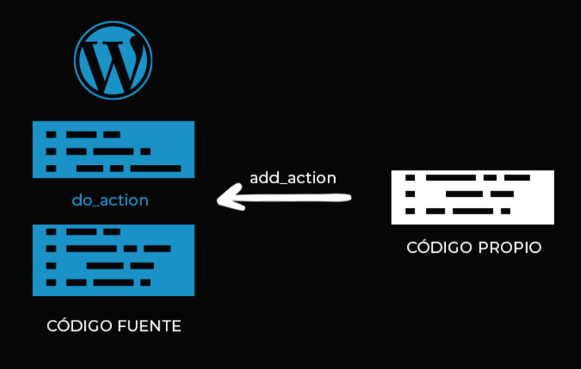
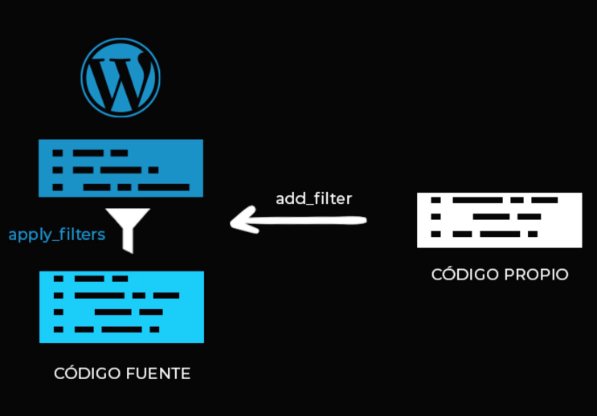
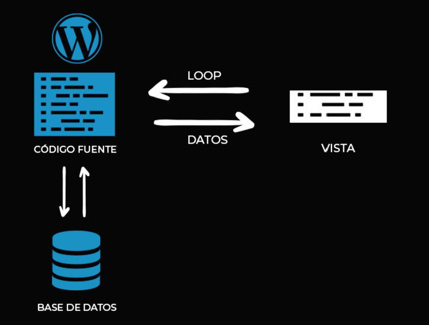

# Curso Práctico de WorPress


## Tabla de contenido


- [Introducción](#introducción)
- [Themes](#themes)
- [hooks en WordPress](#hooks)
  - [Tipos de hooks](#tipos-de-hooks)
- [Manejo de librerías](manejo-de-librerias)
  - [css](#css)
  - [JavaScript](#javascript)
- [Creando un Theme](#creando-un-theme)
- [Uso de librerías css en el Theme](#uso-de-librerías-css-en-el-theme)
- [Uso de librerías JS en el Theme](#uso-de-librerías-js-en-el-theme)
- [Crear un Menú](#crear-un-menú)
- [Widgets](#widgets)
- [Post Types](#post-types)
- [Los Loops](#los-loops)
- [Crear un Page.php para Páginas](#crear-un-page.php-para-páginas)
- [Crar un Single.php para las Entradas](#crear-un-single.php-para-nuestras-entradas)
- [Crear una página principal con front-page.php](#crear-una-página-principal-con-front-page.php)
- [Generar un Post Type](#generar-un-post-type)
- [Personalizar el Loop para la página principal](#personalizar-el-loop-para-la-página-principal)
- [Plugins](#plugins)
- [Creando un plugin](#creando-un-plugin)
- [Creando página 404](#creando-página-404)


## Introducción


WordPress es un sistema de gestión de contenido **CMS** (Content Management System). desarrollado en **PHP** y adaptado para funcionar en entornos que utilizan los sistemas de gestión de bases de datos **MySQL**.

## Themes


Son la estructura de archivos la cual va a generar las vistas dentro de nuestro navegador. Estos archivos toman la información de la base de datos MySQL y genera el código HTML que se envía al navegador.

Se necesita dos archivos para generar un template **index.php** y el **style.css**

**Otros archivos que vamos a utilizar son:**

**front-page.php**
Es la vista que carga por defecto como página de inicio (es decir, es la primer página que se va a ver cuándo carguemos nuestro sitio).

**footer.php**
En este archivo indicaremos la información del pie de página (es decir, la parte de abajo, además, de las dependencias que queramos cargar ahí).

**functions.php**
Nos va a permitir poder tener nuestro propio código para ampliar las funcionalidades del código fuente de Wordpress.

**header.php**
Va a cargar la parte de arriba a demás de las dependencias que deseemos cargar ahí.

**404.php**
Va a generar la vista de la página del error que se va a generar cuando alguien entra a una URL que no existe.

**page.php**
Pertenece a las páginas que generemos dentro del administrador.

**screenshot.png**
Es la imagen de referencia que vamos a tener en nuestro administrador a la hora de elegir el templet.

**single.php**
Es la vista que carga por defecto como para entradas, cuando no se le especifica una concreta.
Todos estos archivos son importantes porque es lo que va a dar dinamismo al diseño de nuestro sitio. Si nosotros no generamos todos estos archivos, entonces, todo nuestro contenido se va a ver igual que el archivo index.php

## Hooks


Son funciones de WordPress que nos van a permitir agregar código propio al código fuente de WordPress

### Tipos de Hooks


**Action**: Nos permite ejecutar una función personalizada en un punto específico del código de Wordpress.

<div align="center">
  
  <small><p>Hook add_action</p></small>
</div>

Forma de ejecutar una hook `add_action`

```php
<?php
function holaMundo() {
  echo "hola mundo";
}

add_action('wp_head', 'holaMundo') // add_action($hook, $function)
```

https://developer.wordpress.org/reference/functions/add_action/

**Filter**: Nos permite ejecutar una función personalizada en un determinado punto, pero la función que usemos tendrá un parámetro de entrada y dentro de nuestra función haremos modificadores al parámetro y finalmente lo retornaremos modificado.


<div align="center">
  
  <small><p>Hook add_action</p></small>
</div>

Forma de ejecutar una hook `add_filter`


```php
<?php
// pasar un titulo a mayusculas
function upperTitle($title) { // le pasamos una variable - arg $title que podemos modificar y retornar
  return strtoupper($title); // lo convertimos a mayusculas y lo retornamos
}

add_filter('the_title', 'upperTitle'); // add_filter($hook, $function)
```

https://developer.wordpress.org/reference/functions/add_filter/

## Manejo de librerías


Para cada tipo de archivo vamos a usar una función diferente.

### CSS


para las librerías CSS vamos a usar dos funciones:

**1. `wp_register_style()`**: Esta función es la encargada de **registrar** la librería y que la tengamos a disposición como una dependencia pero no las va a ejecutar en nuestro HTML.

**Argumentos**

- `$handle string`: el nombre de nuestra librería para WordPress string que puede ser cualquiera
- `$src string|bool`: el source que puede ser un string o un boleano
- `$deps = array() array`: Las dependencias van a ser un array de strings los nombres o los handles que fuimos registrando previamente.
- `$ver = string|bool|null`: la versión es importante por si tenemos una versión de caché para poder decirle a nuestro navegador que nos regenere nuestro pedido en caso de que se creara modificaciones.
- `$media = 'all' string`: el media nos va a permitir que nuestro CSS se pueda ejecutar en todos lados o en una resolución en específico.

**2. `wp_enqueue_style()`**: Esta función va a **ejecutar** la librería que nosotros le digamos pero va a llamar las referencias si se necesita de alguna.

**Argumentos** recibe los mismos argumentos pero en vez de registrarlo y dejarlo a disposición es ejecutarlo directamente en nuestro HTML

- `$handle string`: el nombre de nuestra librería para WordPress string que puede ser cualquiera
- `$src string|bool`: el source que puede ser un string o un boleano
- `$deps = array() array`: Las dependencias van a ser un array de strings los nombres o los handles que fuimos registrando previamente.
- `$ver = string|bool|null`: la versión es importante por si tenemos una versión de caché para poder decirle a nuestro navegador que nos regenere nuestro pedido en caso de que se creara modificaciones.
- `$media = 'all' string`: el media nos va a permitir que nuestro CSS se pueda ejecutar en todos lados o en una resolución en específico.

### JavaScript


para las librerías JS vamos a usar dos funciones:

**1. `wp_register_script()`**: Esta función es la encargada de **registrar** la librería y que la tengamos a disposición como una dependencia pero no las va a ejecutar en nuestro HTML.

**Argumentos**

- `$handle string`: el nombre de nuestra librería para WordPress string que puede ser cualquiera
- `$src string|bool`: el source que puede ser un string o un boleano
- `$deps = array() array`: Las dependencias van a ser un array de strings los nombres o los handles que fuimos registrando previamente.
- `$ver = string|bool|null`: la versión es importante por si tenemos una versión de caché para poder decirle a nuestro navegador que nos regenere nuestro pedido en caso de que se creara modificaciones.
- `$in_footer = false bool`: Para decirle que se ejecute en el footer o se ejecute en el header.

**2. `wp_enqueue_script()`**: Esta función va a **ejecutar** la librería que nosotros le digamos pero va a llamar las referencias si se necesita de alguna.

**Argumentos** recibe los mismos argumentos pero en vez de registrarlo y dejarlo a disposición es ejecutarlo directamente en nuestro HTML

- `$handle string`: el nombre de nuestra librería para WordPress string que puede ser cualquiera
- `$src string|bool`: el source que puede ser un string o un boleano
- `$deps = array() array`: Las dependencias van a ser un array de strings los nombres o los handles que fuimos registrando previamente.
- `$ver = string|bool|null`: la versión es importante por si tenemos una versión de caché para poder decirle a nuestro navegador que nos regenere nuestro pedido en caso de que se creara modificaciones.
- `$in_footer = false bool`: Para decirle que se ejecute en el footer o se ejecute en el header.

## Creando un Theme


Buscamos la carpeta de nuestro Theme en:

`C:\xampp\htdocs\[wodpress-directory]\wp-content\themes\[name-theme]`

- Creamos el archivo `index.php` y `style.css`

creamos el archivo obligatorio `index.php` este archivo que es la vista por defecto de cualquier vista que no este asignada.


`index.php`

```php
  <?php get_header(); ?> // con esta función llamamos al header.php
  <?php get_footer(); ?> // con esta función llamamos al footer.php
```

creamos el archivo `style.css`

```css
/*
Theme Name: Landing Page KeyAction Theme
Author: Juan Diego Silva G.
Author URI: https://github.com/juandiego26
Description: Landing Page KeyAction.
Version: 1.0
License: GNU General Public License v2 or later
License URI: http://www.gnu.org/licenses/gpl-2.0.html
Tags: landing-page, bootstrap, custom-template, responsive.
*/

a,
h1,
h2,
h3,
h4,
li,
p,
span,
ul {
  font-family: Montserrat;
}
.attachment-large {
  max-width: 100%;
  height: auto !important;
}
h1 {
  margin: 50px 0;
  font-weight: 900;
}
ul {
  margin-bottom: 0px;
}
header {
  background-color: #1c3643;
}
header nav li {
  list-style: none;
  display: inline-block;
  padding: 0 15px;
}
header nav li a {
  color: #fff;
  text-transform: uppercase;
}
header nav li a:hover {
  color: #fff;
}
footer {
  background-color: #1c3643;
  padding: 10px 0;
}
footer {
  color: white;
}
footer p {
  margin: 0;
  color: #fff;
}
.lista-productos h2 {
  font-weight: 900;
}
.lista-productos h4 {
  font-weight: 400;
}
.lista-productos h4 a {
  color: #000;
}
```

Creamos el archivo `header.php`

```html
<!DOCTYPE html>
<html lang="en">
  <head>
    <meta charset="UTF-8" />
    <meta name="viewport" content="width=device-width, initial-scale=1.0" />
    <?php wp_head();  ?>
    // trae todas las funciones o código propio que hagan referencia al hook
    get_header() donde estaba el title
  </head>
  <body></body>
</html>
```

https://developer.wordpress.org/reference/functions/wp_head/

creamos el archivo `footer.php`

```html
<?php wp_footer(); ?> // trae todas las funciones o código propio que hagan referencia al hook get_footer()
</body>
</html>
```

Creamos el archivo archivo `functions.php` para agregar funciones de soporte a nuestro theme. Todas las funciones o código propio lo agregamos en functions php.

```php
<?php

function init_template() { // el nombre es asignado por nosotros
  add_theme_support('post-thumbnails'); // función que nos permite que dentro de todas nuestras entradas y páginas podamos usar una imagen destacada
  add_theme_support('title-tag'); // lo que va a ser es imprimir en nuestro wp_head() del header.php el title de la página
}

add_action('after_septup_theme', 'init_template') // hook add_action para que se ejecute la función
```

https://developer.wordpress.org/reference/functions/add_theme_support/

Creamos el archivo `screenshot.png` con una resolución 880x660


## Uso de librerías css en el Theme


- Creamos una función para registrar Bootstrap y dejarlo como dependencia en `functions.php`

```php
<?php

// function init template

function init_template() {
  add_theme_support('post-thumbnails');
  add_theme_support('title-tag');
}

add_action('after_septup_theme', 'init_template')

// función para registar librerías css en el theme
function assets() {
  // registramos las dependencias porque queremos que se carguen antes que nuestro style.css
  wp_register_style('bootstrap', 'https://stackpath.bootstrapcdn.com/bootstrap/4.4.1/css/bootstrap.min.css', '', '4.4.1', 'all');
  wp_register_style('montserrat', 'https://fonts.googleapis.com/css?family=Montserrat&display=swap','','1.0', 'all');
  // ejecutamos el style.css
  /*
    la función get_stylesheet_uri() nos la provee wordpress y lo que hace es retornar
    la direccíon exacta donde se encuentra nuestro archivo style.css.
    array con las dependencias que se carguen antes de nuestros estilos
  */
  wp_enqueue_style('estilos', get_stylesheet_uri(), array('bootstrap','montserrat'),'1.0', 'all');
}

add_action('wp_enque_scripts', 'assets'); // para que se ejecute la función
```

## Uso de librerías JS en el Theme


```php
<?php

// function init template

function init_template() {
  add_theme_support('post-thumbnails');
  add_theme_support('title-tag');
}
add_action('after_septup_theme', 'init_template')

// Función para registar las librerías de CSS y JS en el theme

function assets() {
  // registramos los estilos
  wp_register_style('bootstrap', 'https://stackpath.bootstrapcdn.com/bootstrap/4.4.1/css/bootstrap.min.css', '', '4.4.1', 'all');
  wp_register_style('montserrat', 'https://fonts.googleapis.com/css?family=Montserrat&display=swap','','1.0', 'all');

  wp_enqueue_style('estilos', get_stylesheet_uri(), array('bootstrap','montserrat'),'1.0', 'all');
}

// registramos las librerías de JS
wp_register_script('popper','https://cdn.jsdelivr.net/npm/popper.js@1.16.0/dist/umd/popper.min.js','','1.16.0', true); // true para que se ejecute en el footer
wp_enqueue_script('boostrapjs', 'https://stackpath.bootstrapcdn.com/bootstrap/4.4.1/js/bootstrap.min.js', array('jquery','popper'),'4.4.1', true);
// wordpress carga automaticamente el JQuery con 'jquery'

// ejecutamos el archivo custom.js
/*
  Lo llamamos de forma dinámica con una función get_template_directory_uri(); para que cada
  vez que nuestro archivo se encuentre en una URL diferente no tenga ningun tipo de problema
  para ser llamado concatenado con un string de la ubicación.
*/
wp_enqueue_script('custom', get_template_directory_uri().'/assets/js/custom.js', '', '1.0', true);
}

add_action('wp_enqueue_scripts', 'assets');

```

Por último colocamos un logo en el archivo `header.php`

```html
<!DOCTYPE html>
<html lang="en">
  <head>
    <meta charset="UTF-8" />
    <meta name="viewport" content="width=device-width, initial-scale=1.0" />
    <?php wp_head();  ?>
    // trae todas las funciones o código propio que hagan referencia al hook
    get_header() donde estaba el title
  </head>
  <body>
    <header>
      <div class="container">
        <div class="row">
          <div class="col-4">
            /assets/img/logo.png"
              alt="logo"
            />
            <!-- funcion get_template_uri() para saber donde se encuentra el template de wordpress
          con echo retorna no imprime-->
          </div>
        </div>
      </div>
    </header>
  </body>
</html>
```

## Crear un Menú


En el archivo `functions.php` registramos una localización; es decir, donde el administrador de Wordpress pueda insertar un menú. Para eso usamos una función `register_nav_menus()`

```php
<?php

// function init template

function init_template() {
  add_theme_support('post-thumbnails');
  add_theme_support('title-tag');

  // registramos el menú
  /*
    el primer argumento es un array y el primera propiedad del array es una referencia 'top-menu'
    con valor una descripción 'Menú Principal'
  */
  register_nav_menus(array(

  ));
}
add_action('after_septup_theme', 'init_template')

// Función para registar las librerías de CSS y JS en el theme
function assets() {
  // registramos los estilos
  wp_register_style('bootstrap', 'https://stackpath.bootstrapcdn.com/bootstrap/4.4.1/css/bootstrap.min.css', '', '4.4.1', 'all');
  wp_register_style('montserrat', 'https://fonts.googleapis.com/css?family=Montserrat&display=swap','','1.0', 'all');
  wp_enqueue_style('estilos', get_stylesheet_uri(), array('bootstrap','montserrat'),'1.0', 'all');
  // registramos las librerías de JS
  wp_register_script('popper','https://cdn.jsdelivr.net/npm/popper.js@1.16.0/dist/umd/popper.min.js','','1.16.0', true); // true para que se ejecute en el footer
  wp_enqueue_script('boostrapjs', 'https://stackpath.bootstrapcdn.com/bootstrap/4.4.1/js/bootstrap.min.js', array('jquery','popper'),'4.4.1', true);
  wp_enqueue_script('custom', get_template_directory_uri().'/assets/js/custom.js', '', '1.0', true);
}
add_action('wp_enqueue_scripts', 'assets');

```

En el administrador creamos un nuevo menú y lo llamamos Menú Principal

https://developer.wordpress.org/reference/functions/register_nav_menus/

Para imprimir el menú nos vamos al archivo `header.php`


```html
<!DOCTYPE html>
<html lang="en">
  <head>
    <meta charset="UTF-8" />
    <meta name="viewport" content="width=device-width, initial-scale=1.0" />
    <?php wp_head();  ?>
    // trae todas las funciones o código propio que hagan referencia al hook
    get_header() donde estaba el title
  </head>
  <body>
    <header>
      <div class="container">
        <div class="row align-items-center">
          <div class="col-4">
            /assets/img/logo.png"
              alt="logo"
            />
            <!-- funcion get_template_uri() para saber donde se encuentra el template de wordpress
          con echo retorna no imprime-->
          </div>
          <div class="col-8">
            <nav>
              <!-- wp_nav_menu(); nos permite imprimir el menú 
            recibe como argumento un array() con varios valores
            1- localización del menú dentro del admin de wordpress
            2- es una clase para nuestros estilos del menú
            3- una clase al contenedor
            -->
              <?php wp_nav_menu(
              array(
                'theme_location' =>
              'top-menu', 'menu_class' => 'menu-principal', 'container_class' =>
              'container_menu' ) ); ?>
            </nav>
          </div>
        </div>
      </div>
    </header>
  </body>
</html>
```

https://developer.wordpress.org/reference/functions/wp_nav_menu/

## Widgets


Es un componente que se puede colocar en diferentes zonas, como por ejemplo, la barra lateral o un pie de página.

En el archivo `functions.php` creamos una función que se llama `sidebar()`

```php
<?php

// function init template
function init_template() {
  add_theme_support('post-thumbnails');
  add_theme_support('title-tag');
  register_nav_menus(array(
  ));
}
add_action('after_septup_theme', 'init_template')

// Función para registar las librerías de CSS y JS en el theme
function assets() {
  // registramos los estilos
  wp_register_style('bootstrap', 'https://stackpath.bootstrapcdn.com/bootstrap/4.4.1/css/bootstrap.min.css', '', '4.4.1', 'all');
  wp_register_style('montserrat', 'https://fonts.googleapis.com/css?family=Montserrat&display=swap','','1.0', 'all');
  wp_enqueue_style('estilos', get_stylesheet_uri(), array('bootstrap','montserrat'),'1.0', 'all');
  // registramos las librerías de JS
  wp_register_script('popper','https://cdn.jsdelivr.net/npm/popper.js@1.16.0/dist/umd/popper.min.js','','1.16.0', true); // true para que se ejecute en el footer
  wp_enqueue_script('boostrapjs', 'https://stackpath.bootstrapcdn.com/bootstrap/4.4.1/js/bootstrap.min.js', array('jquery','popper'),'4.4.1', true);
  wp_enqueue_script('custom', get_template_directory_uri().'/assets/js/custom.js', '', '1.0', true);
}
add_action('wp_enqueue_scripts', 'assets');

//función sidebar

function sidebar() {
  // función de wordpress llamada register_sidebar
  /*
    recibe como argumento un array con las siguientes propiedades
    1- name: El nombre es pie de pagina porque lo queremos agregar en nuestro footer
    2- id: para que lo renderize dentro del html.
    3- description: como aparece en el admin de wordpress
    4-before_title: Lo que le pasemos antes de que cargue el title una etiqueta <p>
    5- after_title: le pasamos el cierre </p>
    6- before_widget: muy similar a before_title pero al contenido del widget
    7- after_widget: cerramos el </div>

  */

  register_sidebar(
    array(
      'name' => 'Pie de pagina',
      'id' => 'footer',
      'description' => 'Zona de widgets para pie de página',
      'before_title' => '<p>',
      'after_title' => '</p>',
      'before_widget' => '<div id="%1$s" class="%2$s">', // para autogenerar el ID widget mismo dependiendo de que contenido que utilicemos las clases igual pero con un valor de referencia diferente.
      'after_widget' => '</div>'
    )
  )
}

add_action('widgets_init', 'sidebar' );

```


WordPress en los hooks para los módulos que sean plural como por ejemplo widgets o menús usa el plural y `wp_head` y `wp_footer()` va a ser en singular.

https://developer.wordpress.org/reference/functions/register_sidebar/

para imprimirlo nos vamos al archivo `footer.php`

```html
<footer>
  <div class="container">
    <?php dynamic_sidebar('footer');?> // el id con el cual se registró
  </div>
</footer>
<?php wp_footer(); ?> // trae todas las funciones o código propio que hagan referencia al hook get_footer()
</body>
</html>
```

## Post Types


WordPress tiene muchos tipos diferentes de contenido, a cada uno de estos tipos se le llama **Post Type (Tipo de Contenido)**

Podemos encontrar dentro del admin de Wordpress:

- Post types Entradas
- Post types Pages
- Post types Media como imagenes, audio y videos
- Post types Menus

En el momento en que nosotros necesitemos generar un tipo de contenido que no esté contemplado por Wordpress vamos a generar un Post Type personalizado o **Custom Post Type** Esto sería por ejemplo si tenemos un sitio de una biblioteca y necesitemos mostrar libros podemos crear el custom post type y asignar las características que necesitan estos post type libros.

## Los Loops


Un Loop en WordPress es una herramienta que nos permite mostrar el contenido que tenemos guardado en nuestro administrador.

Este contenido funciona cada vez que alguien ingresa a nuestro sitio y ejecuta este loop

<div align="center">
  
  <small><p>Como funciona el loop de WordPress</p></small>
</div>

Exiten dos tipos de Loops

**- Forma básica**: Este se ejecuta por defecto en nuestras paginas de vistas como por ejemplo el `page.php` o `single.php` y nos sirve para mostrar el contenido por defecto de esa página puntual o esa entrada puntual.

**- Personalizado**: Que es utilizando el objeto `WP_Query` de wordpress el cual podemos decirle específicamente que datos queremos retornar, por ejemplo si queremos las entradas de una fecha en especifico o si queremos un custom post type.

## Crear un Page.php para Páginas


Inicializamos nuestras vistas para las paginas páginas

En el admin de Wodpress vamos a **paginas** y añadimos una pagina nueva le ponemos un titulo y agregamos un bloque de texto que diga **Cualquier cosa**. La publicamos y vemos que no muestra nada, para ello vamos al editor de código y creamos una página llamada `page.php`

`page.php` esta es una vista que va a cargar wordpress

```php
<?php get_header(); ?> // cargamos el header

/*
  En este caso como es un loop por defecto que es mostrar el contenido de una página
  usamos el loop básico

  Preguntamos si hay Post con la función have_post() hace que si todavía queda contenido para
  mostrar devuelva true y si no queda contenido que mostrar devuelva false.

  la función the_post(): es para saber wordpress que no tiene contenido para mostrar
  instancia cada vuelta que dé nuestro while para traer la información. Es decir si solo va a mostrar un pagina va a mostrar el contenido una vez suma uno y va decirle a have_post() que no tiene contenido para mostrar

  la función the_title() retorna el titulo de nuestra página y lo va a imprimir

  La función the_content() retorna e imprime el contenido que tengamos guardado de los cloques de guttembert en nuestra pagina
*/

<main class='container'>
    <?php if(have_posts()){ // Loop básico
            while(have_posts()){ // while para instanciar el contenido de nuestra page
              the_post(); ?>
            <h1 class='my-3'><?php the_title(); ?></h1> // traemos el title con HTML

            <?php the_content(); ?> // función para mostrar el contenido

         <?php }
    }?>
</main>

<?php get_footer(); ?> // pie de página
```

Para entender el funcionamiento de la función `have_post()`

https://developer.wordpress.org/reference/functions/have_posts/

https://developer.wordpress.org/reference/functions/the_post/

## Crar un Single.php para las Entradas

Creamos la vista para nuestras entradas o posts para ello utilizamos el archivo `single.php`. Este archivo no solo hace referencia a nuestras entradas (posts) de blog, si no que cuando creemos un `custom post type` nos va a servir para las vistas de ello también.

`single.php`

```php
<?php get_header(); ?> // cargamos el header

/*
  Ejecutamos un loop básico al igual que page.php

  Preguntamos si hay Post con la función have_post() hace que si todavía queda contenido para
  mostrar devuelva true y si no queda contenido que mostrar devuelva false.

  la función the_post(): es para saber wordpress que no tiene contenido para mostrar
  instancia cada vuelta que dé nuestro while para traer la información. Es decir si solo va a mostrar un pagina va a mostrar el contenido una vez suma uno y va decirle a have_post() que no tiene contenido para mostrar

  la función the_post_thumbnail() trae la imagen destacada en el tamaño que nosotros digamos, es decir, cuando subimos esta imagen a una carpeta de media nos sube la imagen en 4 (original, large, medium, thumbnail)

  La función the_content() retorna e imprime el contenido que tengamos guardado de los cloques de guttembert en nuestra pagina
*/

<main class='container my-3'>
    <?php if(have_posts()){ // Loop básico
            while(have_posts()){ // while para instanciar el contenido de nuestra page
              the_post();
            ?>
            <h1 class="my-3">
              <?php the_title();?> // para imprimir el titulo
            </h1>
            <div class="row">
              <div class="col-6">
                <?php the_post_thumbnail('large'); ?> // le pasamos una imagen en versión large
              </div>
              <div class="col-6">
                <?php the_content();?> // función para mostrar el contenido
              </div>
            </div>
         <?php }
    }?>
</main>

<?php get_footer(); ?> // pie de página
```

https://developer.wordpress.org/reference/functions/the_post_thumbnail/

## Crear una página principal con front-page.php


Vamos al admin de Wordpress y creamos una pagina nueva le llamamos `[nombre-pagina]` y le ponemos una imagen de portada añadiendo un bloque nuevo el bloque de imagen en gutenberg de Wordpress.

Ahora vamos a ajustes de lectura en el wordpress y elegimos una página estática para la portada, es decir, portada va a ser nuestra página principal

Ahora creamos la vista con el archivo `front-page.php`


`front-page.php`


```php
<?php get_header(); ?> // agregamos el encabezado

<main class='container'>
    <?php if(have_posts()){ // loop básico que inicializa nuestra página principal
            while(have_posts()){
                the_post(); ?>
            <h1 class='my-3'><?php the_title(); ?>!!</h1> // imprimimos el titulo con the_title();
            <?php the_content(); ?> // traemos el contenido
        <?php    }
    }?>
</main>

<?php get_footer(); ?>
```

## Generar un Post Type


Vamos al archivo `functions.php` y creamos una función `productos_type()`

```php
<?php

// function init template
function init_template() {
  add_theme_support('post-thumbnails');
  add_theme_support('title-tag');
  register_nav_menus(array(
  ));
}
add_action('after_septup_theme', 'init_template')

// Función para registar las librerías de CSS y JS en el theme
function assets() {
  // registramos los estilos
  wp_register_style('bootstrap', 'https://stackpath.bootstrapcdn.com/bootstrap/4.4.1/css/bootstrap.min.css', '', '4.4.1', 'all');
  wp_register_style('montserrat', 'https://fonts.googleapis.com/css?family=Montserrat&display=swap','','1.0', 'all');
  wp_enqueue_style('estilos', get_stylesheet_uri(), array('bootstrap','montserrat'),'1.0', 'all');
  // registramos las librerías de JS
  wp_register_script('popper','https://cdn.jsdelivr.net/npm/popper.js@1.16.0/dist/umd/popper.min.js','','1.16.0', true); // true para que se ejecute en el footer
  wp_enqueue_script('boostrapjs', 'https://stackpath.bootstrapcdn.com/bootstrap/4.4.1/js/bootstrap.min.js', array('jquery','popper'),'4.4.1', true);
  wp_enqueue_script('custom', get_template_directory_uri().'/assets/js/custom.js', '', '1.0', true);
}
add_action('wp_enqueue_scripts', 'assets');

//función sidebar

function sidebar() {
  register_sidebar(
    array(
      'name' => 'Pie de pagina',
      'id' => 'footer',
      'description' => 'Zona de widgets para pie de página',
      'before_title' => '<p>',
      'after_title' => '</p>',
      'before_widget' => '<div id="%1$s" class="%2$s">',
      'after_widget' => '</div>'
    )
  )
}

add_action('widgets_init', 'sidebar' );

// Función para nuestro custom post type productos

function productos_type(){
  // la función register_post_type() para crear nuestor custom post type
  // recibe dos argumetos
  // 1. el nombre de nuestro post type 'producto' en singular
  // 2. $args todas las configuraciones que queremos recibir en nuestro post type
  // $args es un array de datos

  $labels = array( // labels
        'name' => 'Productos', // nombre en la sesión de productos
        'singular_name' => 'Producto', // el mensaje en el admin este en singular
        'manu_name' => 'Productos', // el nombre en el menú del administrador
    );

  $args = array(
        'label'  => 'Productos', // el nombre por defecto
        'description' => 'Productos de Platzi', // una descripción
        'labels'       => $labels, // para personalizar aun más los mensajes que podamos ver el admin
        'supports'   => array('title','editor','thumbnail', 'revisions'), // que opciones puede tener este custom post type
        // 1- title para el titulo
        // 2- editor para cargar contenido.
        // 3- thumbnail: imagen destacada.
        // 4- revisions: va a ser que cada vez que nosostros guardemos una entrada podamos tener un historico de todas las modificaciones.
        'public'    => true, // como queremos cuando publiquemos las entradas aparezcan como borrador o directamente publicadas. TRUE como publicadas y FALSE como borrador.
        'show_in_menu' => true, // en la página de opciones de menú podamos agragar las opciones de posts types personzalizados que tengamos creadas true
        'menu_position' => 5, // posición en el admin van de 5 en 5
        'menu_icon'     => 'dashicons-cart', // icono con el cual va a aparecer en el admin
        'can_export' => true, // si se puede exportar true
        'publicly_queryable' => true, // para poder traer con un loop personalizado true
        'rewrite'       => true, // esto lo que hace es que nuestro post type tenga una url asignada
        'show_in_rest' => true // que nuestros datos pertenezca a la API de wordpress

    );
    register_post_type('producto', $args);
}

add_action('init', 'productos_type');

```

url del custom posts type `localhost/platzigifts/producto/tazas`

https://developer.wordpress.org/reference/functions/register_post_type/

Para los tipos de labels

https://developer.wordpress.org/reference/functions/get_post_type_labels/

Para los tipos de support

https://developer.wordpress.org/reference/functions/add_post_type_support/

para los dashicons

https://developer.wordpress.org/resource/dashicons/#wordpress

Debemos refrescar nuestros enlaces permanentes.

## Personalizar el Loop para la página principal


Vamos a al archivo `front-page.php`

```php
<?php get_header(); ?> // agregamos el encabezado

<main class='container'>
    <?php if(have_posts()){ // loop básico que inicializa nuestra página principal
            while(have_posts()){
                the_post(); ?>
            <h1 class='my-3'><?php the_title(); ?>!!</h1> // imprimimos el titulo con the_title();
            <?php the_content(); ?> // traemos el contenido
        <?php    }
    }?>

    <div class="lista-productos my-5">
      <h2 class="text-center">PRODUCTOS</h2>
      <div class="row">
        // generamos una instancia del objeto WP_Query recibe un argumento que es un array
        //
        <?php
          $args = array(
            'post_type' => 'producto', // corresponde al mismo slug que usamos en functions para registrarlo
            'posts_per_page' => -1 // un entero para que nos traiga todos los productos
          );
          $productos = new WP_Query($args);
          if($productos -> have_posts()) { // instanciamos de productos
            while($productos -> have_posts()) {
              $productos -> the_post();
          ?>
            // solo una vez porque el loop se encarga de poner los post que vamos haciendo en el
            // custom post-type
            <div class="col-4">
              <figure>
                <?php the_post_thumbnail('large')?>
              </figure>
              <h4 class="my-3 text-center">
                // para los urls utilizamos la función the_permalink() esta función lo que
                // va a hacer es retornarnos las urls que corresponde a ese producto y la va
                // imprimir
                <a href="<?php the_permalink(); ?>">
                  <>
                </a>
              </h4>
            </div>
        <?php
            }
          }
        ?>
      </div>
    </div>
</main>

<?php get_footer(); ?>

```


Para crear un loop personalizado

https://developer.wordpress.org/reference/classes/wp_query/

https://developer.wordpress.org/reference/classes/wp_query/#post-type-parameters

https://www.sitepoint.com/sanitizing-escaping-validating-data-in-wordpress/

https://wp-kama.com/function/esc_url

Link de importancia para las URLS internas en WordPress

https://wordpress.stackexchange.com/questions/50995/internal-links-to-pages-in-php

https://stackoverflow.com/questions/50201252/how-to-add-php-code-in-href-attribute-in-wp-page-content

**Pregunta**
Si por ejemplo, se tiene un link en cualquier section de la página que me lleve a una página de agradecimiento por haber descargado un tipo de software de prueba.

Cómo hago para poner en el atributo `href` código PHP para la url de esa pagina; ya que, el link de la página de agradecimiento no va a estar en el menú?

**Respuesta**
Si necesitas un link específico de una página creada desde WordPress se puede traer usando la función `get_permalink()` está función va a recibir como parámetro el ID de la página de la cual necesitamos el link. Por ejemplo, queremos crear un link a la página de agradecimiento. Lo primero que tenemos que hacer es conseguir el ID de esa página, entonces tenes que ir al administrador, páginas, entrar a la página de agradecimiento y en el URL del navegador vas a ver esto:

`miweb.com/wp-admin/post.php?post=253&action=edit`

El valor de post, este caso 253 es el ID que estás buscando. Ya teniendo este dato solo tenes que crear el link de esta forma.

`<a href='<?php echo get_permalink(253)?>' >Agradecimiento</a>`
Tenemos que usar el echo en este caso porque a diferencia de `the_permalink()` esta función solo trae el dato, no lo imprime.

## Plugins


Los plugin son componentes que nos van a ayudar a la ampliación de nuestras funcionalidades:

**recomendaciones a la hora de elegir un plugin**

- **Compatibilidad**: Verificar que el plugin es compatible con nuestra versión de WordPress
- **Calificación**:Verificar la calificación del plugin y los comentarios.
- **Mantenimiento**: Verificar si la última actualización fue hace mucho tiempo.
- **Funcionalidad**: Verificar que el plugin no tenga demasiadas funcionalidades a las que realmente necesitemos.

## Creando un plugin


Crearemos un plugin que haga que la vista de nuestro tema se vea en modo oscuro.
Vamos a ruta `wp-content/plugins/[nombre-plugin]`

creamos el archivo `plugin-[nombre-plugin].php`

```php
<?php

// Plugin name: Modo Oscuro
// Description: Activa el modo oscuro
// Author: Juan Diego
// Author URI: https://github.com/silgajuandiego

function estilos_plugin(){
  $estilos_url = plugin_dir_url(__FILE__);
  // __FILE__ es una constante de PHP que devuelve la ubicación en el disco de este archivo
  // plugin_dir_uri() es una función de Worpdress para convertirlo en la URL donde puede
  // encontrar este archivo

  wp_enqueue_style('modo_oscuro', $estilos_url.'/aseets/css/estilo.css', '', '1.0', 'all');
}

add_action('wp_enqueue_scripts', 'estilos_plugin');

```

Creamos una carpeta `assets/css/estilo.css`

```css
body {
  background-color: black !important;
}

p,
span,
h1,
h2,
h3,
h4,
a {
  color: white !important;
}
```

**Notas personales**

Pregunta: Por que aquí usamos directamente `wp_enqueue_style` y no se usó primero `wp_register_style`

En este caso se usó el `enqueue` porque es el único archivo que se va a cargar en el plugin. Si este archivo fuera necesario para que otro funcione, se hubiese cargado con un `register`.

https://developer.wordpress.org/reference/functions/plugin_dir_url/

## Creando página 404


El archivo `404.php` Es importante porque cuando un usuario entre a una pagina que no exista por defecto va a tomar la vista del `index.php` y no va a entender que está perdido o que está en una página 404.

`404.php`


```php
<?php get_header() ?>

<main class='container'>
    <div class="pagina404 my-5">
        <h1>404 PÁGINA NO ENCOTRADA</h1>
        <h2>Haga <a href="<?php echo home_url(); ?>">click aquí</a>  para volver a la página principal</h2>
    </div>
</main>

// la función home_url() nos retorna la URL de la página principal pero no nos la va imprimir
// asi si que con PHP ponemos un ECHO para que la pueda imprimir.

<?php get_footer() ?>
```

https://developer.wordpress.org/reference/functions/home_url/
