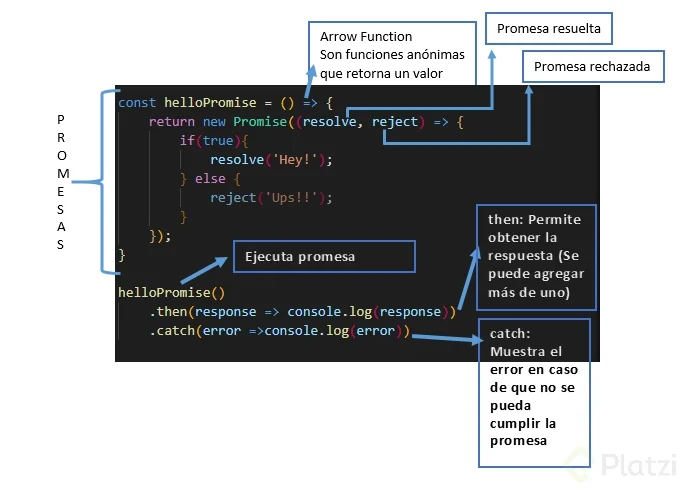

# Curso de ECMAScript6+ 


## Tabla de contenido


- [Introducción](#introducción)
- [Default Params y Concatenación](#default-params-y-Concatenación)
- [LET y CONST, Multilínea, Spread Operator y Desestructuración](#let-y-const,-multilínea,-spread-operator-y-Desestructuración)
- [Arrow Functions, Promesas y Parámetros en objetos](#arrow-functions,-promesas-y-parámetros-en-objetos)
- [Clases, Módulos y Generadores](#clases,-módulos-y-generadores)
  - [Creación de Objetos en JavaScript](#creación-de-objetos-en-javascript)
- [Que se implementó en ES7](#que-se-implementó-en-es7)
- [Que se implementó en ES8](#que-se-implementó-en-es8)
- [Que se implementó en ES9](#que-se-implementó-en-es9)
- [Que se implementó en ES10](#que-se-implementó-en-es10)


## Introducción

ECMA es la especificación del lenguaje propuesto por **ECMA Internacional** que es una institución encargada de los estandares y JavaScript es el lenguaje que utiliza esta especicificación para trabajar sobre estas características que van siendo añadidas que van siendo añadidas año con año a partir del 2015 que fue el año dond se lanzó la versión 6


https://www.ecma-international.org/publications/standards/Ecma-262.htm


## Default Params y Concatenación

```js
function newFunction(name, age, country) {
  var name = name || 'Juan';
  var age = age || 32;
  var country = country || 'CO';
  console.log(name, age, country);
}

// es6
function newFunction2(name = 'Juan', age = 32, country = 'CO') {
  console.log(name, age, country);
}

newFunction2(); // toma el valor de los parámetros por defecto

newFunction2('Diego', '20', 'MX'); // muestra los parámetros que le pasamos

// `template literals`

let hello = "hello";
let world = "World";
let epicPhrase = hello + ' ' + world;
console.log(epicPhrase);

// es6

let epicPhrase2 = `${hello} ${world}`;
console.log(epicPhrase2);
```


## LET y CONST, Multilínea, Spread Operator y Desestructuración

```js

// multilinea
let lorem = "Quit consequatur. commodi. Ipsum vel duis yet minima \n" + "Lorem ipsum dolor sit amet, consectetur adipiscing elit, sed do eiusmod tempor incididunt"
// Es6 multilínea
let lorem2 = `Otra frase épica que necesitamos 
Ahora es otra frase.
`;

console.log(lorem);
console.log(lorem2);


// desestructuración

let person = {
  'name': 'Juan',
  'age': '32',
  'country': 'CO'
}

console.log(person.name, person.age, person.country);

// ES6
let { name, age } = person;

console.log(name);

// Spread Operator

let team1 = ['Oscar', 'Juan', 'Ricardo'];

let team2 = ['Valeria', 'Yesica', 'Camila'];

let education = ['David', ...team1, ...team2] // trae los valores del arreglo

console.log(education);

// declaracion de variables

var hola = 'hola'; // esta disponible en el scope global

{
  var globalVar = 'Global Var';

}

{
  let globalLet = 'Global let';
  console.log(globalLet); // solo está disponible en el código
}

console.log(globalVar); // Global var es accesible en el scope global
// console.log(globalLet); // Global let no es es accesible da un error

// Const permite estableces una variable 

const a = 'b';
a = 'a'; // no se puede asignar un valor a una constante
console.log(a);

// anteriormente con var

var a = 'b';
a = 'a'; // con var si se puede reasignar las variables
console.log(a);

```


## Arrow Functions, Promesas y Parámetros en objetos


<div align="center">
  
  <small><p>Estructura de una promesa</p></small>
</div>


```js
/******* Arrow Functions, Promesas y Parámetros en objetos */
let name = "Juan";
let age = 32;

// es5
obj = { name: name, age: age };
//es6
obj2 = { name, age };
console.log(obj2);

// arrow functions

const names = [
  { name: "Juan", age: 32 },
  { name: "Pedro", age: 22 },
];
// ES5
let listOfNames = names.map(function (item) {
  console.log(item.name);
});

//ES6

let listOfNames2 = names.map((item) => console.log(item.name));

// varios parámetros
const listOfNames3 = (name, age, country) => {
  //code...
};
// un solo parámetro
const listOfNames4 = (name) => {
  // code...
};

const square = (num) => num * num;

/*****Promesa */
const helloPromise = () => {
  return new Promise((reject, resolve) => {
    if (false) {
      resolve("hey!");
    } else {
      reject("Upss!!");
    }
  });
};

// ejecutamos nuestra promesa

helloPromise()
  .then((response) => console.log(response))
  .catch((error) => console.log(error));
```


## Clases, Módulos y Generadores


### Creación de Objetos en JavaScript

En JavaScript existen diferentes formas de crear objetos, la intención de este artículo es repasar esas maneras, pero además de eso entender el momento ideal de cuanto utilizar cada una de ellas. Entre ellas encontramos:

- Por medio de objetos literales
- Por medio de una función constructora
- Utilizando new Object()
- Objeto literal en combinación con new Object()
- Utilizando clases (ES6)

#### Objetos Literales

Este tipo de objetos se definen dentro de brackets, se asignan sus propiedades por medio de clave y valor

```javascript
//Ejemplo de Objeto literal
var Luis = {
  sexo: "M", //Clave - Valor
  peso: 80,
  altura: 180
};

console.log("La altura de Luis es " + Luis.altura + "cm");
```

#### Cuándo utilizar esta manera de definir objetos?

Está manera se utiliza cuando se define una **única instancia** de un objeto, por ejemplo acá la instancia sería Luis, pero que hubiera pasado, si tendría que crear a David, Kevin y Paolo?, para eso es mejor crear un constructor que se llame persona y así poder crear múltiples instancias.

Como se puede ver en el ejemplo, estamos duplicando mucho código, para que hacer esto, si los 3 tienen las mismas propiedades?

```javascript
//Ejemplo de una mala práctica con Objetos literales
var Luis = {
  sexo: "M", //Clave - Valor
  peso: 80,
  altura: 180
};
var David = {
  sexo: "M", //Clave - Valor
  peso: 90,
  altura: 190
};
var Paolo = {
  sexo: "M", //Clave - Valor
  peso: 100,
  altura: 170
};
```

#### Función constructora

Se crea una función la cual asigna sus propiedades con el `this` (haciendo referencia a la futura instancia del objeto), además puede recibir parámetros para su inicialización.

#### Cuándo se utiliza la función constructora?

Se utiliza cuando quieres tener **múltiples instancias** de un objeto, se crea la función de la siguiente forma, y luego se crean las instancias.

```javascript
//function constructora
function Persona(sexo, peso, altura){
  this.sexo = sexo;
  this.peso = peso;
  this.altura = altura;
}

//instancias

var Luis = new Persona("M", 80, 180);
var David = new Persona("M", 90 , 192);

//Imprimir propiedades
console.log("Luis Pesa " + Luis.peso + " Kg");

console.log("David Pesa " + David.peso + " Kg");
```

#### New Object()

En esta forma se crea la instancia del objeto y luego se le asignan los valores.

```javascript
//se crea la instancia del objecto
var Luis = new Object();

//se le asignan valores
Luis.sexo = "M";
Luis.peso = 80;
Luis.altura = 180;

//se imprimen valores
console.log("Luis Pesa " + Luis.peso + "kg");
```

#### Cuándo se utiliza esta manera?

se puede utilizar de igual forma, cuando solo se necesita una única instancia de un objeto. Si analizas bien, es igual que usar objetos literales, solo que la otra forma es un poco más simple, entonces es una buena práctica utilizar objetos literales, en lugar de crearlos con esta forma.

#### Objeto Literal en combinación con New Object

En esta forma creamos un objeto literal como si fuera una clase y luego creamos nuestros objetos con new Object()

```javascript
// Creamos como si fuera una clase
var Persona = {
  init: function(sexo, peso, altura){
    this.sexo = sexo;
    this.peso = peso;
    this.altura = altura;
  },
  saludar: function(){
    console.log("hola, mi peso es " + this.peso);
  }
}

// Hacemos la instancia del objecto
var Luis = new Object(Persona);
//Llamamos a nuestro método init, como si fuera un constructor
Luis.init( "M", 80, 180);
//Llamamos métodos
Luis.saludar();
```


#### Cuándo se utiliza esta manera?

Se puede utilizar cuando se requieren múltiples instancias, además a diferencia de la función constructora tiene la ventaja que los métodos pertenecen al prototipo padre(en este caso Persona) entonces si pueden ir dentro de él, si tienes dudas acerca de prototipos, te invito a leer:

**Javascript — Prototipos y Herencia**
*Lo primero que hay que recordar es que en Javascript casi todo es un objeto, y que Javascript está basado en…* 
https://medium.com/luismbcr/javascript-prototipos-y-herencia-ec4b0c695ef

#### Clases(ES6)

Con ES6 ahora es posible utilizar clases, que en realidad no son clases, porque al final detrás de esto, se trabaja con prototipos, esto se conoce como sugar syntax.

```javascript
// Definimos la clave
class Persona {
  constructor(sexo, altura, peso) {
    this.sexo = sexo;
    this.altura = altura;
    this.peso = peso;
  }
}

// Definimos la instancia
var Luis = new Persona("M", 180, 80);

// Imprimimos las propiedades
console.log("El peso de Luis es " + Luis.peso + " kg");
```


#### Cuándo se utiliza esta manera?

Esta manera se utiliza cuando también se necesitan **múltiples instancias**, y si tenemos la opción de trabajar con ES6, tiene sus ventajas sobre las funciones constructoras, como que con las clases no se aplica el hoisting.


#### Referencias

**Object**
*The Object constructor creates an object wrapper.*developer.mozilla.org https://developer.mozilla.org/en-US/docs/Web/JavaScript/Reference/Global_Objects/Object

**Object prototypes**
*This article has covered JavaScript object prototypes, including how prototype object chains allow objects to inherit…*developer.mozilla.org  https://developer.mozilla.org/en-US/docs/Learn/JavaScript/Objects/Object_prototypes

**Classes**
*JavaScript classes, introduced in ECMAScript 2015, are primarily syntactical sugar over JavaScript's existing…*developer.mozilla.org  https://developer.mozilla.org/en-US/docs/Web/JavaScript/Reference/Classes


## Que se implementó en ES7


```js
// includes para saber si hay un valor dentro de un array o string

let numbers = [1, 3, 7, 8];

if (numbers.includes(9)) {
  console.log("Si se encuentra el valor 7");
} else {
  console.log("No se encuentra.");
}

// exponencial

let base = 4;
let exponent = 3;
let result = base ** exponent;

// antes
console.log(Math.pow(base, exponent));
//ES7
console.log(result);
```


## Que se implementó en ES8


```js
// Object.entries devuelve la clave y los valores de un arreglo
const data = {
  frontend: "Juan",
  backend: "Ana",
  desing: "Isabel",
};

const entries = Object.entries(data);
console.log(entries); // [['frontend', 'Juan']['backend', 'Ana']]
console.log(entries.length); // 3 *elementos del objeto*

// Object.values() devuelve los valores de un objeto
const data = {
  frontend: "Juan",
  backend: "Ana",
  desing: "Isabel",
};

const values = Object.values(data);
console.log(values); // ['Juan', 'Ana', 'Isabel']
console.log(values.length); // 3 # d elementos

// padding ES8 agrgar una cadena vacia o elementos a un string

const string = "hello";
console.log(string.padStart(7, "hi"));
console.log(string.padEnd(12, " ------"));

// Async/Await
const helloWorld = () => {
  return new Promise((resolve, reject) => {
    true
      ? setTimeout(() => resolve("hello World"), 3000)
      : reject(new Error("Test Error"));
  });
};

const helloAsync = async () => {
  const hello = await helloWorld();
  console.log(hello);
};

helloAsync();

const anotherFunction = async () => {
  try {
    const hello = await helloWorld();
    console.log(hello);
  } catch (error) {
    console.log(error);
  }
};

anotherFunction();

```


## Que se implementó en ES9


- Operador de reposo (rest operator)
- Operador de propagación (spread operator)
- Promise.finally()
- Mejoras para regexp: grupos de captura con nombre (named capture groups)
- para conocer más a detalle los features de ES9, te recomiendo el siguiente post por Yeison Daza: https://yeisondaza.com/es2018-parte2-rest-spread-object-y-promise-finally


```js
/** rest operator u operador de reposo */
const obj = {
  name: "Juan",
  age: 32,
  country: "CO",
};

let { name, ...all } = obj;
// ... operador de reposo o rest operator para separar los elementos
// extraemos name y todo lo demás se coloca en este valor ALL
console.log(name, all); // Juan {age: 32, country: 'CO'} desestructura name
/******** */
let { country, ...all } = obj;

console.log(all); // {name: 'Juan', age: 32 } excluye country

/** spread operator u operador de propagación */

const obj = {
  name: "Juan",
  age: 32,
};

const obj1 = {
  ...obj, // une el objeto obj1 con el obj
  country: "CO",
};

console.log(obj1); //  name: 'Juan', age: 32, country: 'CO' }

/** Promise.finally() */

const helloWorld = () => {
  return new Promise((resolve, reject) => {
    true
      ? setTimeout(() => resolve("hello World"), 3000)
      : reject("Test Error");
  });
};

helloWorld()
  .then((response) => console.log(response))
  .catch((error) => console.log(error))
  .finally(() => console.log("Finalizo")); // finalizó la promesa

/** Expresiones regulares regEX por grupos*/

const regexData = /([0-9]{4})-([0-9]{2})-([0-9]{2})/

const match = regexData.exec('2018-04-20');
const year = match[1];
const month = match[2];
const day = match[3];

console.log(year, month, day);

```


## Que se implementó en ES10


`flat()`: crea una nueva matriz con todos los elementos de sub-array concatenados recursivamente hasta la profundidad especificada.

`flatMap()`: primero mapea cada elemento usando una función de mapeo, luego aplana el resultado en una nueva matriz.

```js
//--------------method flat---------------/
//devolver una matriz con una submatriz aplanada,
//recibe como argunmento la profundidad
let array = [1, 2, 3, [1, 2, 3, [1, 2, 3]]];

console.log(array.flat(2));

//-------------flatMap---------------------------/
//mapear cada elemento, luego pasarle una funcion y aplanar

let array = [1, 2, 3, 4, 5];

console.log(array.flatMap((value) => [value, value * 2]));

//----------------trim---------------------------/
let hello = "                      hello world";
console.log(hello);
console.log(hello.trimStart()); // inicio

let hello = "hello world                  ";
console.log(hello);
console.log(hello.trimEnd()); // final

//-------------optional catch biding-------------/

try {
} catch /*(error) ya no es necesario colocarlo*/ {
  error;
}

//-------------fromEntries----------------------/
// array to object
let entries = [
  ["name", "oscar"],
  ["age", 32],
];
console.log(Object.fromEntries(entries));

//-------------symbol object--------------------/
let mySymbol = "My Symbol";
let symbol = Symbol(mySymbol);
console.log(symbol.description);

```

https://tc39.es/

